# Aurora DSP ICEpower Booster

**6-Kanal Balanced Audio Interface** — Aurora FreeDSP → ICEpower Verstärkermodul

Dieses Board sitzt zwischen einem **Aurora FreeDSP DSP-Prozessor** und sechs **ICEpower Class-D Verstärkermodulen**. Es empfängt 6 symmetrische (balanced) Audiosignale vom DSP, verstärkt diese einstellbar um 0–11,3 dB, schützt die Signale und gibt sie wieder als symmetrische XLR-Signale aus.

> **Hinweis zur Vollständigkeit:** Alle Bauteilreferenzen, Netznamen und Pinzuordnungen in diesem Dokument wurden direkt aus der verifizierten KiCad-Netzliste extrahiert (177/177 Validierungen bestanden) und reichen aus, um den Schaltplan ohne die `.kicad_sch`-Datei vollständig nachzubauen.

---

## Inhaltsverzeichnis

1. [Spezifikationen](#spezifikationen)
2. [Systemübersicht](#systemübersicht)
3. [Signalkette — Detail](#signalkette--detail)
4. [Spannungsversorgung](#spannungsversorgung)
5. [Muting & Remote-Steuerung](#muting--remote-steuerung)
6. [Gain-Einstellung](#gain-einstellung)
7. [Vollständige Bauteil-Referenz](#vollständige-bauteil-referenz)
8. [Schematic nachbilden](#schematic-nachbilden)

---

## Spezifikationen

| Parameter | Wert |
|-----------|------|
| Kanäle | 6 (identisch) |
| Eingang | 6× XLR Female, Pin 2 = Hot, Pin 3 = Cold, Pin 1 = GND |
| Ausgang | 6× XLR Male, Pin 2 = Hot, Pin 3 = Cold, Pin 1 = GND |
| Versorgung | 24 V DC (Barrel Jack) |
| Op-Amp-Versorgung | ±11 V (Low-Noise LDO) |
| Gain-Bereich | 0 dB bis +11,3 dB (8 Stufen via DIP-Switch) |
| Eingangsimpedanz | ~10 kΩ balanced |
| Ausgangsimpedanz | ~47 Ω (Serien-R) |
| CMRR Eingang | ~62 dB (4× 10 kΩ 0,1 % Metallfilm) |
| SNR-Ziel | > 100 dB |
| THD+N-Ziel | < 0,01 % @ 1 kHz |
| Schnittstelle Remote | 3,5 mm Klinke (Aurora FreeDSP Custom Out) |
| Fertigung | JLCPCB, 2-Layer, FR-4, HASL, 200 × 200 mm |

---

## Systemübersicht

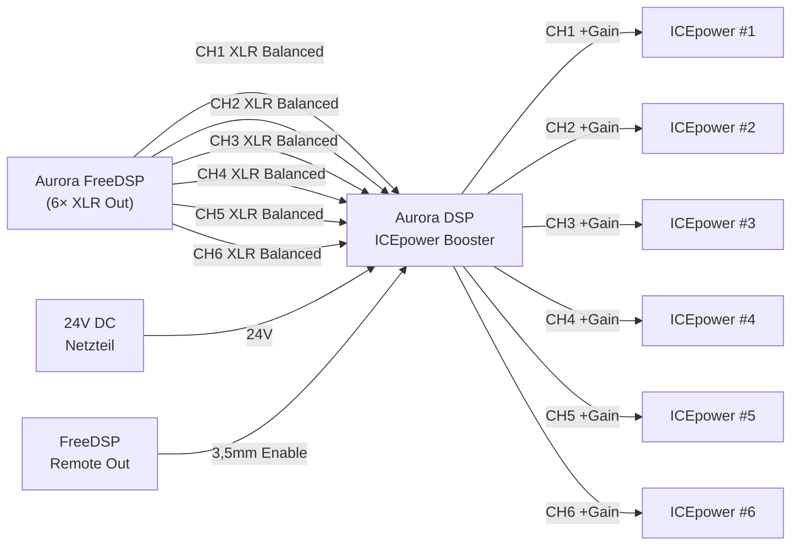

---

## Signalkette — Detail

Alle 6 Kanäle sind **identisch** aufgebaut. Die folgenden Diagramme zeigen **CH1** — für CH2–CH6 gelten dieselben Topologien mit den entsprechenden Bauteil-Nummern.

### Überblick — eine Kanalstufe

```mermaid
flowchart LR
    XIN["XLR IN\nJ3–J8"]
    ESD1["ESD-Schutz\nEingang"]
    EMI["EMI-Filter\n47Ω + 100pF"]
    DC["DC-Blocking\n2,2µF C0G"]
    DIFF["Diff-Receiver\nLM4562 Unit A"]
    GAIN["Gain-Stufe\nLM4562 Unit B"]
    MUTE["Muting\nBSS138"]
    DRV["Balanced Driver\nLM4562 (2. IC)"]
    ZOB["Zobel\n10Ω + 100nF"]
    ESD2["ESD-Schutz\nAusgang"]
    XOUT["XLR OUT\nJ9–J14"]

    XIN --> ESD1 --> EMI --> DC --> DIFF --> GAIN --> MUTE --> DRV --> ZOB --> ESD2 --> XOUT
```

---

### Stufe 1 — ESD-Schutz & EMI-Filter (Eingang)

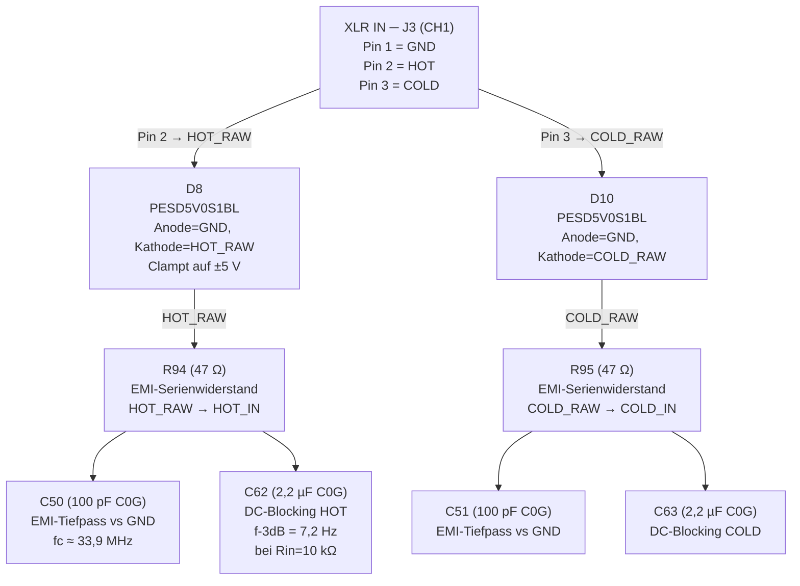

**Bauteile CH1 — ESD & Filter:**

| Ref | Wert | Funktion | Netz |
|-----|------|----------|------|
| J3 | XLR Female | Eingang CH1 | Pin1=GND, Pin2=/CH1_HOT_RAW, Pin3=/CH1_COLD_RAW, PinG=GND |
| D8 | PESD5V0S1BL | ESD HOT_RAW | A=GND, K=/CH1_HOT_RAW |
| D10 | PESD5V0S1BL | ESD COLD_RAW | A=GND, K=/CH1_COLD_RAW |
| R94 | 47 Ω | EMI-Filter HOT | /CH1_HOT_RAW → /CH1_EMI_HOT |
| R95 | 47 Ω | EMI-Filter COLD | /CH1_COLD_RAW → /CH1_EMI_COLD |
| C50 | 100 pF C0G | HF-Bypass HOT | /CH1_EMI_HOT → GND |
| C51 | 100 pF C0G | HF-Bypass COLD | /CH1_EMI_COLD → GND |
| C62 | 2,2 µF C0G | DC-Blocking HOT | /CH1_EMI_HOT → /CH1_HOT_IN |
| C63 | 2,2 µF C0G | DC-Blocking COLD | /CH1_EMI_COLD → /CH1_COLD_IN |

---

### Stufe 2 — Differenzieller Receiver (LM4562 Unit A)

Der Differenz-Empfänger wandelt das balanced Signal (HOT + COLD) in ein Single-Ended Signal um und unterdrückt Gleichtaktstörungen (CMRR ~62 dB).

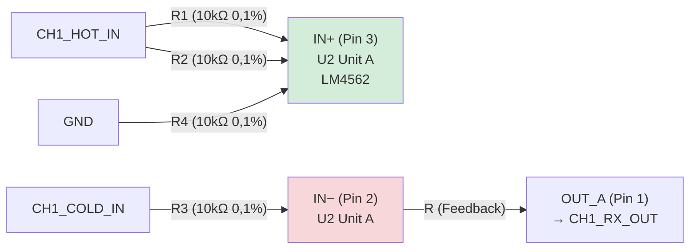

**Klassische Differenzverstärker-Formel:**

$$G_{diff} = \frac{R_f}{R_{in}} = \frac{10\,k\Omega}{10\,k\Omega} = 1 \quad (0\,\text{dB})$$

$$CMRR \approx 20 \cdot \log_{10}\!\left(\frac{2 \cdot \frac{\Delta R}{R}}{1}\right)^{-1} \approx 62\,\text{dB}$$
(bei 0,1 % Widerstandstoleranz)

**Bauteile CH1 — Differenzieller Receiver:**

| Ref | Wert | Funktion | Verbindung |
|-----|------|----------|------------|
| U2 (Unit A) | LM4562 | Diff-Receiver | Pin3=IN+_A, Pin2=IN-_A, Pin1=OUT_A |
| R2 | 10 kΩ 0,1% | Rin+ (IN+_A Referenz) | GND → /CH1_HOT_IN |
| R3 | 10 kΩ 0,1% | Rg (COLD Input) | /CH1_COLD_IN → /CH1_INV_IN |
| R14 | 10 kΩ 0,1% | Rref- (IN-_A Referenz) | GND → /CH1_INV_IN |
| R20 | 10 kΩ 0,1% | Rf (Feedback) | /CH1_RX_OUT → /CH1_INV_IN |

---

### Stufe 3 — Gain-Stufe (LM4562 Unit B)

Die zweite Op-Amp-Einheit (Unit B desselben LM4562) verstärkt das Signal invertierend. Die drei DIP-Switch-Widerstände werden **parallel** zum Eingangs-Widerstand R geschaltet und erniedrigen dadurch den effektiven Rin → höhere Verstärkung.

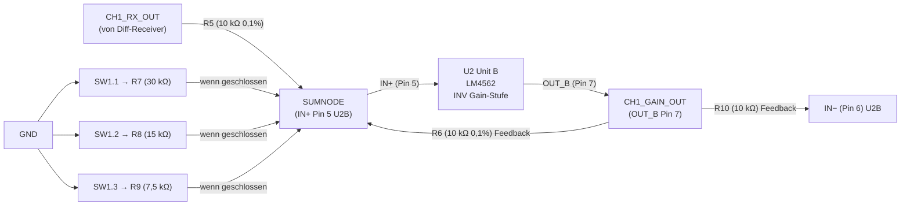

**Bauteile CH1 — Gain-Stufe:**

| Ref | Wert | Funktion | Verbindung |
|-----|------|----------|------------|
| U2 (Unit B) | LM4562 | Gain-Verstärker (inv.) | Pin6=IN-_B=/CH1_SUMNODE, Pin5=IN+_B=GND, Pin7=OUT_B |
| R26 | 10 kΩ 0,1% | Rin (Eingang) | /CH1_RX_OUT → /CH1_SUMNODE |
| R50 | 10 kΩ 0,1% | Rf (Feedback) | /CH1_GAIN_OUT → /CH1_SUMNODE |
| R27 | 30 kΩ | DIP SW1 Pos3 | /CH1_SW_OUT_1 → /CH1_SUMNODE (parallel zu Rin wenn SW geschl.) |
| R28 | 15 kΩ | DIP SW1 Pos2 | /CH1_SW_OUT_2 → /CH1_SUMNODE |
| R29 | 7,5 kΩ | DIP SW1 Pos1 | /CH1_SW_OUT_3 → /CH1_SUMNODE |
| SW1 | SW_DIP_x03 | Gain-Wahl CH1 | Pos1→/CH1_SW_OUT_3, Pos2→/CH1_SW_OUT_2, Pos3→/CH1_SW_OUT_1 (andere Seite je = /CH1_RX_OUT) |

---

### Stufe 4 — Muting (BSS138 MOSFET)

Beim Einschalten werden die LDOs erst nach einer RC-Verzögerung aktiviert. Solange die Versorgung stabil ist, sperren Q2–Q7 den Signalweg und verhindern Einschalt-Knackgeräusche.

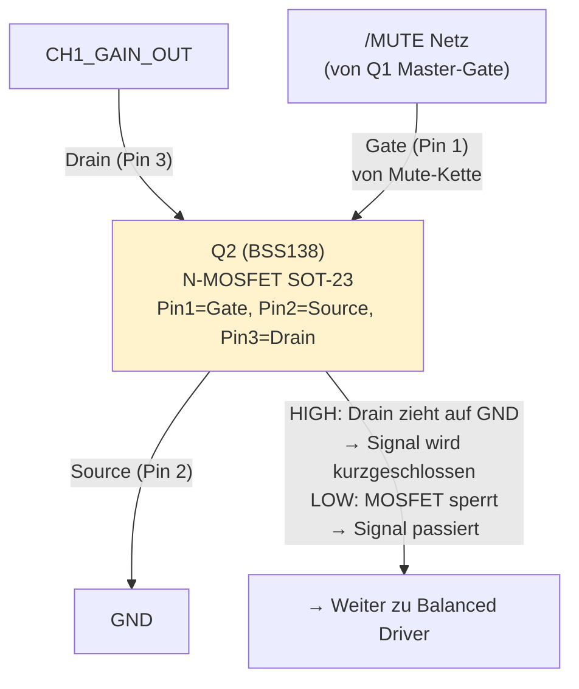

> **Muting-Logik (Einschalt-Sequenz):**
>
> 1. LDOs werden aktiv → /V+ steigt
> 2. R107 (100 kΩ, /V+ → /MUTE) zieht /MUTE sofort auf HIGH
> 3. Q2–Q7 (Gate = HIGH via R108–R113) leiten → alle GAIN_OUT-Netze kurzgeschlossen → **Audio gemuted**
> 4. Gleichzeitig lädt R106 (10 kΩ) + C80 (10 µF) den Gate von Q1: τ = R106 × C80 = 100 ms
> 5. Nach ~100 ms: Q1-Gate > V_th → Q1 leitet → /MUTE auf GND gezogen
> 6. Q2–Q7-Gates = GND → sperren → **Audio frei**
>
> Ergebnis: 100 ms nach LDO-Aktivierung wird der Mute aufgehoben. Verhindert Einschalt-Knackser.

**Bauteile Muting (alle Kanäle):**

| Ref | Wert | Funktion | Verbindung |
|-----|------|----------|------------|
| R106 | 10 kΩ | Q1 Gate-Lade-R | /V+ → Net-(Q1-G) |
| C80 | 10 µF | RC-Timing Q1 | Net-(Q1-G) → GND (τ = 100 ms) |
| Q1 | BSS138 | Master Mute-MOSFET | G=Net-(Q1-G), S=GND, D=/MUTE |
| R107 | 100 kΩ | /MUTE Pullup | /V+ → /MUTE |
| R108 | 10 kΩ | Gate-R Q2 | /MUTE → Net-(Q2-G) |
| R109 | 10 kΩ | Gate-R Q3 | /MUTE → Net-(Q3-G) |
| R110 | 10 kΩ | Gate-R Q4 | /MUTE → Net-(Q4-G) |
| R111 | 10 kΩ | Gate-R Q5 | /MUTE → Net-(Q5-G) |
| R112 | 10 kΩ | Gate-R Q6 | /MUTE → Net-(Q6-G) |
| R113 | 10 kΩ | Gate-R Q7 | /MUTE → Net-(Q7-G) |
| Q2 | BSS138 | Mute CH1 | G=Net-(Q2-G), S=GND, D=/CH1_GAIN_OUT |
| Q3 | BSS138 | Mute CH2 | G=Net-(Q3-G), S=GND, D=/CH2_GAIN_OUT |
| Q4 | BSS138 | Mute CH3 | G=Net-(Q4-G), S=GND, D=/CH3_GAIN_OUT |
| Q5 | BSS138 | Mute CH4 | G=Net-(Q5-G), S=GND, D=/CH4_GAIN_OUT |
| Q6 | BSS138 | Mute CH5 | G=Net-(Q6-G), S=GND, D=/CH5_GAIN_OUT |
| Q7 | BSS138 | Mute CH6 | G=Net-(Q7-G), S=GND, D=/CH6_GAIN_OUT |

---

### Stufe 5 — Balanced Driver (LM4562, 2. IC)

Ein separater LM4562 erzeugt aus dem Single-Ended Gain-Signal ein symmetrisches Ausgangssignal.

- **Unit A** puffert das (bereits invertierte) Gain-Signal → speist XLR Pin 3 (COLD = invertiert)
- **Unit B** invertiert nochmals → speist XLR Pin 2 (HOT = doppelte Inversion = korrekte Polarität)

Die Gain-Stufe (U2B) ist invertierend, daher ist GAIN_OUT bereits phasengedreht. Der Treiber stellt die richtige Polarität an beiden XLR-Pins wieder her.

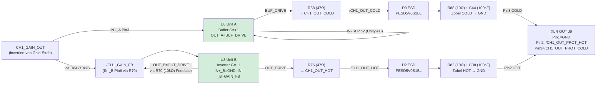

**Bauteile CH1 — Balanced Driver & Ausgang:**

| Ref | Wert | Funktion | Verbindung |
|-----|------|----------|------------|
| U8 (Unit A) | LM4562 | COLD-Buffer (G=+1) | IN+_A(Pin3)=/CH1_GAIN_OUT, IN-_A(Pin2)=OUT_A(Unity-FB), OUT_A(Pin1)=/CH1_BUF_DRIVE |
| U8 (Unit B) | LM4562 | HOT-Inverter (G=−1) | IN+_B(Pin5)=GND, IN-_B(Pin6)=/CH1_GAIN_FB, OUT_B(Pin7)=/CH1_OUT_DRIVE |
| R64 | 10 kΩ | Inverter Rin | /CH1_GAIN_OUT → /CH1_GAIN_FB |
| R70 | 10 kΩ | Inverter Rf | /CH1_OUT_DRIVE → /CH1_GAIN_FB |
| R58 | 47 Ω | Serien-R COLD | /CH1_BUF_DRIVE → /CH1_OUT_COLD |
| R76 | 47 Ω | Serien-R HOT | /CH1_OUT_DRIVE → /CH1_OUT_HOT |
| D9 | PESD5V0S1BL | ESD OUT_COLD | A=GND, K=/CH1_OUT_COLD |
| D2 | PESD5V0S1BL | ESD OUT_HOT | A=GND, K=/CH1_OUT_HOT |
| R88 | 10 Ω | Zobel R COLD | /CH1_OUT_COLD → /CH1_OUT_PROT_COLD |
| C44 | 100 nF C0G | Zobel C COLD | /CH1_OUT_PROT_COLD → GND |
| R82 | 10 Ω | Zobel R HOT | /CH1_OUT_HOT → /CH1_OUT_PROT_HOT |
| C38 | 100 nF C0G | Zobel C HOT | /CH1_OUT_PROT_HOT → GND |
| J9 | XLR Male | Ausgang CH1 | Pin1=GND, Pin2=/CH1_OUT_PROT_HOT, Pin3=/CH1_OUT_PROT_COLD |

---

### Vollständige Signalkette CH1 (alle Netz-Namen)

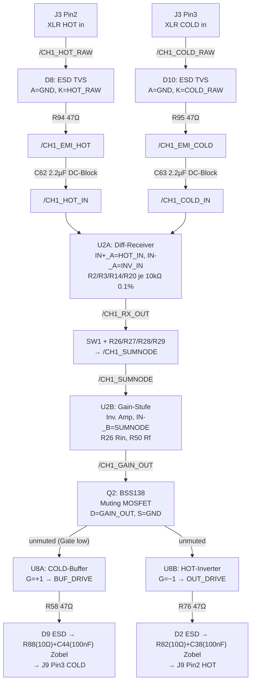

---

## Spannungsversorgung

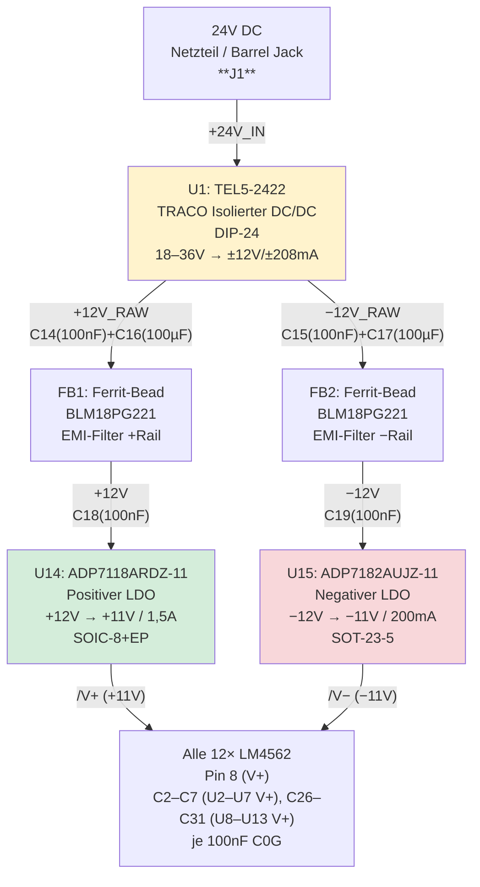

**Bauteile Spannungsversorgung:**

| Ref | Wert | Funktion | Verbindung |
|-----|------|----------|------------|
| J1 | 24V DC Barrel Jack | Eingang | Pin1=/+24V_IN, Pin2=GND |
| U1 | TEL5-2422 | Isolierter DC/DC, DIP-24 | Pin22/23=/+24V_IN, Pin14=/+12V_RAW, Pin11=/-12V_RAW, Pin2/3/9/16=GND |
| C14 | 100 nF C0G | +12V_RAW Bypass | /+12V_RAW → GND |
| C15 | 100 nF C0G | −12V_RAW Bypass | /-12V_RAW → GND |
| C16 | 100 µF/25V | +12V_RAW Bulk | /+12V_RAW → GND |
| C17 | 100 µF/25V | −12V_RAW Bulk | /-12V_RAW → GND |
| FB1 | BLM18PG221 | Ferrit +Rail | /+12V_RAW → /+12V |
| FB2 | BLM18PG221 | Ferrit −Rail | /-12V_RAW → /-12V |
| C18 | 100 nF C0G | /+12V Bypass (nach FB1) | /+12V → GND |
| C19 | 100 nF C0G | /-12V Bypass | /-12V → GND |
| U14 | ADP7118ARDZ-11 | Positiver LDO | Pin7/8=/+12V, Pin1/2/3=/V+, Pin4/9=GND, Pin5=/EN_CTRL, Pin6=/SS_U14 |
| U15 | ADP7182AUJZ-11 | Negativer LDO | Pin2=/-12V, Pin5=/V-, Pin1=GND, Pin3=/EN_CTRL, Pin4=/NR_U15 |
| C22 | 100 nF C0G | U14 VOUT Bypass | /V+ → GND |
| C24 | 10 µF X5R | U14 VOUT Bulk | /V+ → GND |
| C25 | 10 µF X5R | U15 VOUT Bulk | /V- → GND |
| C81 | **22 nF** C0G | U14 Soft-Start (SS-Pin) | /SS_U14 → GND |
| C23 | 100 nF C0G | U15 Noise-Reduction (NR-Pin) | /NR_U15 → GND |
| C20 | 100 µF | V+ Board-Bulk | /V+ → GND |
| C21 | 100 µF | V− Board-Bulk | /V- → GND |

**Op-Amp Entkopplung (100 nF C0G, je 2 pro LM4562 = 24×):**

| Refs V+ | Refs V− | IC |
|---------|---------|---|
| C2 | C8 | U2 (CH1 Diff/Gain) |
| C3 | C9 | U3 (CH2 Diff/Gain) |
| C4 | C10 | U4 (CH3 Diff/Gain) |
| C5 | C11 | U5 (CH4 Diff/Gain) |
| C6 | C12 | U6 (CH5 Diff/Gain) |
| C7 | C13 | U7 (CH6 Diff/Gain) |
| C26 | C32 | U8 (CH1 Driver) |
| C27 | C33 | U9 (CH2 Driver) |
| C28 | C34 | U10 (CH3 Driver) |
| C29 | C35 | U11 (CH4 Driver) |
| C30 | C36 | U12 (CH5 Driver) |
| C31 | C37 | U13 (CH6 Driver) |

Zusätzliche Bulk-Kondensatoren /V+ und /V− für Driver-ICs: C74/C75, C76/C77, C78/C79 (je 10µF X5R).

---

## Muting & Remote-Steuerung

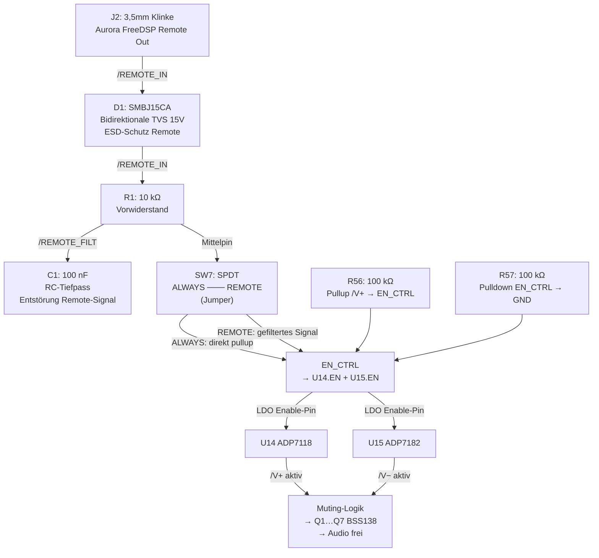

**Funktionsweise:**

- **SW7 = ALWAYS:** EN_CTRL liegt auf HIGH (Pullup R56/Pulldown R57) → LDOs immer aktiv → Board immer betriebsbereit
- **SW7 = REMOTE:** EN_CTRL folgt dem FreeDSP Remote-Signal (J2) über R-C-Filter → Board schaltet sich mit dem DSP ein/aus
- **D1 (SMBJ15CA):** Schützt den Remote-Eingang vor Überspannungen bis ±15V (bidirektional)

**Bauteile Remote & Muting:**

| Ref | Wert | Funktion | Netz |
|-----|------|----------|------|
| J2 | 3,5mm Klinke | Remote-Eingang | PinT=/REMOTE_IN, PinS=GND |
| D1 | SMBJ15CA | ESD Remote 15V bidi | Pin1=/REMOTE_IN, Pin2=GND |
| R1 | 10 kΩ | RC-Vorwiderstand | /REMOTE_IN → /REMOTE_FILT |
| C1 | 100 nF C0G | RC-Tiefpass | /REMOTE_FILT → GND |
| SW7 | SW_SPDT | ALWAYS/REMOTE Wahl | COM=/EN_CTRL, A=/REMOTE_FILT |
| R56 | 100 kΩ | Pullup EN_CTRL | /V+ → /EN_CTRL |
| R57 | 100 kΩ | Pulldown EN_CTRL | /EN_CTRL → GND |

---

## Gain-Einstellung

### DIP-Switch Tabelle (SW1–SW6, identisch pro Kanal)

Jeder Kanal hat einen **3-poligen DIP-Switch** (SW1 = CH1, SW2 = CH2, …, SW6 = CH6).
Die drei Positionen schalten Widerstände **parallel** zum Eingangs-Widerstand der Gain-Stufe. Mehr aktive Schalter = niedrigerer Rin_eff = höhere Verstärkung.

| SW Pos 3 (30kΩ) | SW Pos 2 (15kΩ) | SW Pos 1 (7,5kΩ) | Rin_eff | Gain (×) | Gain (dB) |
|:---:|:---:|:---:|---:|---:|---:|
| OFF | OFF | OFF | 10,00 kΩ | 1,00 | 0,0 dB |
| OFF | OFF | ON | 7,50 kΩ | 1,33 | +2,5 dB |
| OFF | ON | OFF | 6,00 kΩ | 1,67 | +4,4 dB |
| OFF | ON | ON | 5,00 kΩ | 2,00 | +6,0 dB |
| ON | OFF | OFF | 4,29 kΩ | 2,33 | +7,4 dB |
| ON | OFF | ON | 3,75 kΩ | 2,67 | +8,5 dB |
| ON | ON | OFF | 3,33 kΩ | 3,00 | +9,5 dB |
| ON | ON | ON | 2,73 kΩ | 3,66 | **+11,3 dB** |

**Formel:**
$$G = 1 + \frac{R_f}{R_{in,eff}} \quad\text{mit}\quad R_{in,eff} = R_{base} \parallel R_{SW1} \parallel R_{SW2} \parallel R_{SW3}$$

$$R_{in,base} = 10\,k\Omega,\quad R_f = R_{10} = 10\,k\Omega$$

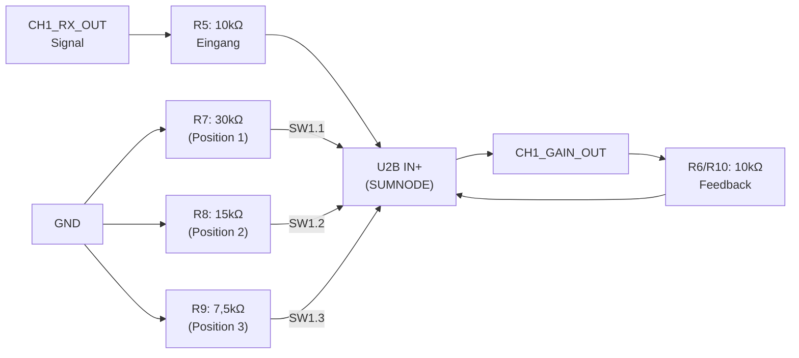

---

## Vollständige Bauteil-Referenz

### Op-Amps: LM4562 (U2–U13)

12× Dual-Op-Amp SOIC-8. Pro LM4562: **Unit A** und **Unit B** (je 1 Op-Amp).

| Ref | Unit A Funktion | Unit B Funktion | V+ auf | V− auf |
|-----|----------------|----------------|-------|-------|
| U2 | CH1 Diff-Receiver | CH1 Gain-Stufe | /V+ | /V− |
| U3 | CH2 Diff-Receiver | CH2 Gain-Stufe | /V+ | /V− |
| U4 | CH3 Diff-Receiver | CH3 Gain-Stufe | /V+ | /V− |
| U5 | CH4 Diff-Receiver | CH4 Gain-Stufe | /V+ | /V− |
| U6 | CH5 Diff-Receiver | CH5 Gain-Stufe | /V+ | /V− |
| U7 | CH6 Diff-Receiver | CH6 Gain-Stufe | /V+ | /V− |
| U8 | CH1 HOT-Buffer | CH1 COLD-Inverter | /V+ | /V− |
| U9 | CH2 HOT-Buffer | CH2 COLD-Inverter | /V+ | /V− |
| U10 | CH3 HOT-Buffer | CH3 COLD-Inverter | /V+ | /V− |
| U11 | CH4 HOT-Buffer | CH4 COLD-Inverter | /V+ | /V− |
| U12 | CH5 HOT-Buffer | CH5 COLD-Inverter | /V+ | /V− |
| U13 | CH6 HOT-Buffer | CH6 COLD-Inverter | /V+ | /V− |

**LM4562 SOIC-8 Pinout** (gemäß TI-Datenblatt):

```
        ┌───────────┐
OUT_A ──┤ 1       8 ├── V+
IN−_A ──┤ 2       7 ├── OUT_B
IN+_A ──┤ 3       6 ├── IN−_B
   V− ──┤ 4       5 ├── IN+_B
        └───────────┘
```

> Pin 5 = **IN+_B** (nicht IN-_B!) und Pin 6 = **IN-_B** — häufige Verwechslung beim LM4562!

---

### Widerstände (R)

#### Diff-Receiver-Netzwerk (4 Widerstände pro Kanal, 0,1% Metallfilm)

| CH | Rin+ (GND→IN+_A) | Rg- (COLD→INV) | Rref- (GND→INV) | Rf (RX_OUT→INV) |
|----|--------------------|--------------------|-------------------|-------------------|
| 1 | R2 | R3 | R14 | R20 |
| 2 | R4 | R5 | R15 | R21 |
| 3 | R6 | R7 | R16 | R22 |
| 4 | R8 | R9 | R17 | R23 |
| 5 | R10 | R11 | R18 | R24 |
| 6 | R12 | R13 | R19 | R25 |

Alle: **10 kΩ 0,1% Metallfilm**

#### Gain-Netzwerk (pro Kanal)

| CH | Rin (RX→SUMNODE) | Rf (GAIN_OUT→SUMNODE) | R_30k (SW Pos3) | R_15k (SW Pos2) | R_7.5k (SW Pos1) |
|----|-----------------|----------------------|----------------|----------------|------------------|
| 1 | R26 | R50 | R27 | R28 | R29 |
| 2 | R30 | R51 | R31 | R32 | R33 |
| 3 | R34 | R52 | R35 | R36 | R37 |
| 4 | R38 | R53 | R39 | R40 | R41 |
| 5 | R42 | R54 | R43 | R44 | R45 |
| 6 | R46 | R55 | R47 | R48 | R49 |

Rin und Rf: **10 kΩ 0,1%**; Gain-Widerstände: 30k / 15k / 7,5k (1%)

#### Driver-Stufe (pro Kanal)

| CH | Rin Inv (GAIN_OUT→GAIN_FB) | Rf Inv (OUT_DRIVE→GAIN_FB) | R_COLD 47Ω (BUF→COLD) | R_HOT 47Ω (DRIVE→HOT) |
|----|--------------------------|--------------------------|----------------------|---------------------|
| 1 | R64 | R70 | R58 | R76 |
| 2 | R65 | R71 | R59 | R77 |
| 3 | R66 | R72 | R60 | R78 |
| 4 | R67 | R73 | R61 | R79 |
| 5 | R68 | R74 | R62 | R80 |
| 6 | R69 | R75 | R63 | R81 |

#### Zobel-Netzwerk — Serien-Widerstände am Ausgang (10 Ω)

| CH | R_Zobel_HOT | R_Zobel_COLD |
|----|-------------|-------------|
| 1 | R82 | R88 |
| 2 | R83 | R89 |
| 3 | R84 | R90 |
| 4 | R85 | R91 |
| 5 | R86 | R92 |
| 6 | R87 | R93 |

#### EMI-Eingangsfilter — Serien-Widerstände (47 Ω)

| CH | R_EMI_HOT | R_EMI_COLD |
|----|-----------|------------|
| 1 | R94 | R95 |
| 2 | R96 | R97 |
| 3 | R98 | R99 |
| 4 | R100 | R101 |
| 5 | R102 | R103 |
| 6 | R104 | R105 |

#### Sonstige Widerstände

| Ref | Wert | Funktion | Verbindung |
|-----|------|----------|------------|
| R1 | 10 kΩ | Remote RC-Filter | /REMOTE_IN → /REMOTE_FILT |
| R56 | 100 kΩ | Pullup EN_CTRL | /V+ → /EN_CTRL |
| R57 | 100 kΩ | Pulldown EN_CTRL | /EN_CTRL → GND |
| R106 | 10 kΩ | Q1 Gate-Lade-R | /V+ → Net-(Q1-G) |
| R107 | 100 kΩ | /MUTE Pullup | /V+ → /MUTE |
| R108–R113 | je 10 kΩ | Gate-Rs Q2–Q7 | /MUTE → Net-(Qx-G) |

---

### Kondensatoren (C)

#### DC-Blocking (2,2 µF C0G, je 2 pro Kanal = 12×)

| CH | C_HOT | C_COLD |
|----|-------|--------|
| 1 | C62 | C63 |
| 2 | C64 | C65 |
| 3 | C66 | C67 |
| 4 | C68 | C69 |
| 5 | C70 | C71 |
| 6 | C72 | C73 |

#### EMI-HF-Filter (100 pF C0G, je 2 pro Kanal = 12×)

| CH | C_HOT | C_COLD |
|----|-------|--------|
| 1 | C50 | C51 |
| 2 | C52 | C53 |
| 3 | C54 | C55 |
| 4 | C56 | C57 |
| 5 | C58 | C59 |
| 6 | C60 | C61 |

#### Zobel-Kondensatoren (100 nF C0G, Ausgangsfilter)

| CH | C_Zobel_HOT | C_Zobel_COLD |
|----|-------------|-------------|
| 1 | C38 | C44 |
| 2 | C39 | C45 |
| 3 | C40 | C46 |
| 4 | C41 | C47 |
| 5 | C42 | C48 |
| 6 | C43 | C49 |

#### Versorgung Bulk & Filter

| Ref | Wert | Funktion | Netz |
|-----|------|----------|------|
| C1 | 100 nF C0G | Remote RC-Filter | /REMOTE_FILT → GND |
| C14 | 100 nF C0G | +12V_RAW Bypass | /+12V_RAW → GND |
| C15 | 100 nF C0G | −12V_RAW Bypass | /-12V_RAW → GND |
| C16 | 100 µF/25V | +12V_RAW Bulk | /+12V_RAW → GND |
| C17 | 100 µF/25V | −12V_RAW Bulk | /-12V_RAW → GND |
| C18 | 100 nF C0G | /+12V Bypass nach FB1 | /+12V → GND |
| C19 | 100 nF C0G | /-12V Bypass nach FB2 | /-12V → GND |
| C20 | 100 µF | V+ Board-Bulk | /V+ → GND |
| C21 | 100 µF | V− Board-Bulk | /V- → GND |
| C22 | 100 nF C0G | U14 VOUT Bypass | /V+ → GND |
| C23 | 100 nF C0G | U15 NR-Pin | /NR_U15 → GND |
| C24 | 10 µF X5R | U14 VOUT Bulk | /V+ → GND |
| C25 | 10 µF X5R | U15 VOUT Bulk | /V- → GND |
| C74–C79 | 10 µF X5R | V+/V− Bulk Driver-ICs | alternierend /V+ und /V- |
| C80 | 10 µF | Q1 Gate RC-Timing | Net-(Q1-G) → GND |
| C81 | 22 nF C0G | U14 Soft-Start | /SS_U14 → GND |

---

### Dioden (D)

#### ESD-Schutz Signalleitungen (24× + 1× = 25 Dioden)

**D1 (SMBJ15CA):** Bidirektionale TVS 15V am Remote-Eingang. Pin1=/REMOTE_IN, Pin2=GND.

**D2–D25 (PESD5V0S1BL):** ESD-Schutz aller Signaleins/ausgänge. A=GND, K=Signalnetz.

Zuordnung pro Kanal:

| CH | D_HOT_RAW | D_COLD_RAW | D_OUT_HOT | D_OUT_COLD |
|----|-----------|-----------|----------|------------|
| 1 | D8 | D10 | D2 | D9 |
| 2 | D11 | D13 | D3 | D12 |
| 3 | D14 | D16 | D4 | D15 |
| 4 | D17 | D19 | D5 | D18 |
| 5 | D20 | D22 | D6 | D21 |
| 6 | D23 | D25 | D7 | D24 |

> D_HOT/COLD_RAW: am XLR-Eingang (vor EMI-Filter)  
> D_OUT_HOT/COLD: am Ausgangsknoten (vor Zobel, nach 47Ω-Serien-R)

**PESD5V0S1BL Pinout (SOD-323):**

```
  GND ─── A │SOD-323│ K ─── Signalnetz
```

---

### Steckverbinder (J)

| Ref | Wert | Typ | Funktion | Pins |
|-----|------|-----|----------|------|
| J1 | 24V DC | Barrel Jack | Versorgungseingang | Pin1=/+24V_IN, Pin2=GND |
| J2 | REMOTE 3,5mm | Audiobuchse 3,5mm | Remote-Eingang (FreeDSP) | PinT=/REMOTE_IN, PinS=GND |
| J3 | XLR_IN_1 | XLR-F 3pol | Eingang CH1 | Pin1=GND, Pin2=/CH1_HOT_RAW, Pin3=/CH1_COLD_RAW, PinG=GND |
| J4 | XLR_IN_2 | XLR-F 3pol | Eingang CH2 | Pin1=GND, Pin2=/CH2_HOT_RAW, Pin3=/CH2_COLD_RAW, PinG=GND |
| J5 | XLR_IN_3 | XLR-F 3pol | Eingang CH3 | Pin1=GND, Pin2=/CH3_HOT_RAW, Pin3=/CH3_COLD_RAW, PinG=GND |
| J6 | XLR_IN_4 | XLR-F 3pol | Eingang CH4 | Pin1=GND, Pin2=/CH4_HOT_RAW, Pin3=/CH4_COLD_RAW, PinG=GND |
| J7 | XLR_IN_5 | XLR-F 3pol | Eingang CH5 | Pin1=GND, Pin2=/CH5_HOT_RAW, Pin3=/CH5_COLD_RAW, PinG=GND |
| J8 | XLR_IN_6 | XLR-F 3pol | Eingang CH6 | Pin1=GND, Pin2=/CH6_HOT_RAW, Pin3=/CH6_COLD_RAW, PinG=GND |
| J9 | XLR3_OUT | XLR-M 3pol | Ausgang CH1 | Pin1=GND, Pin2=/CH1_OUT_PROT_HOT, Pin3=/CH1_OUT_PROT_COLD |
| J10 | XLR3_OUT | XLR-M 3pol | Ausgang CH2 | Pin1=GND, Pin2=/CH2_OUT_PROT_HOT, Pin3=/CH2_OUT_PROT_COLD |
| J11 | XLR3_OUT | XLR-M 3pol | Ausgang CH3 | Pin1=GND, Pin2=/CH3_OUT_PROT_HOT, Pin3=/CH3_OUT_PROT_COLD |
| J12 | XLR3_OUT | XLR-M 3pol | Ausgang CH4 | Pin1=GND, Pin2=/CH4_OUT_PROT_HOT, Pin3=/CH4_OUT_PROT_COLD |
| J13 | XLR3_OUT | XLR-M 3pol | Ausgang CH5 | Pin1=GND, Pin2=/CH5_OUT_PROT_HOT, Pin3=/CH5_OUT_PROT_COLD |
| J14 | XLR3_OUT | XLR-M 3pol | Ausgang CH6 | Pin1=GND, Pin2=/CH6_OUT_PROT_HOT, Pin3=/CH6_OUT_PROT_COLD |

---

### Schalter (SW)

| Ref | Wert | Typ | Funktion |
|-----|------|-----|----------|
| SW1 | Gain CH1 | SW_DIP_x03 | Gain-Wahl CH1 (3 Bit) |
| SW2 | Gain CH2 | SW_DIP_x03 | Gain-Wahl CH2 |
| SW3 | Gain CH3 | SW_DIP_x03 | Gain-Wahl CH3 |
| SW4 | Gain CH4 | SW_DIP_x03 | Gain-Wahl CH4 |
| SW5 | Gain CH5 | SW_DIP_x03 | Gain-Wahl CH5 |
| SW6 | Gain CH6 | SW_DIP_x03 | Gain-Wahl CH6 |
| SW7 | ALWAYS/REMOTE | SW_SPDT | Betriebsmodus EN_CTRL |

---

### MOSFETs (Q)

Alle BSS138, N-Kanal, SOT-23. **Pinout:** Pin 1 = Gate, Pin 2 = Source, Pin 3 = Drain

| Ref | Funktion | Gate | Source | Drain |
|-----|----------|------|--------|-------|
| Q1 | Master Mute-MOSFET | Net-(Q1-G) via R106+C80 | GND | /MUTE |
| Q2 | Mute CH1 | Net-(Q2-G) via R108 | GND | /CH1_GAIN_OUT |
| Q3 | Mute CH2 | Net-(Q3-G) via R109 | GND | /CH2_GAIN_OUT |
| Q4 | Mute CH3 | Net-(Q4-G) via R110 | GND | /CH3_GAIN_OUT |
| Q5 | Mute CH4 | Net-(Q5-G) via R111 | GND | /CH4_GAIN_OUT |
| Q6 | Mute CH5 | Net-(Q6-G) via R112 | GND | /CH5_GAIN_OUT |
| Q7 | Mute CH6 | Net-(Q7-G) via R113 | GND | /CH6_GAIN_OUT |

---

## Schematic nachbilden

Diese Anleitung beschreibt die minimalen Verbindungen, um den Schaltplan von Grund auf nachzubauen. **Alle 6 Kanäle sind identisch** — CH1 vollständig aufbauen, für CH2–CH6 mit entsprechenden Bauteil-Nummern wiederholen.

### Schritt 1 — Versorgung

```
1.  U1 (TEL5-2422, DIP-24) platzieren
    Pin 22, 23 → /+24V_IN (Barrel-Jack J1 Plus)
    Pin 14     → /+12V_RAW
    Pin 11     → /−12V_RAW
    Pin 2,3,9,16 → GND

2.  C14 (100nF C0G) + C16 (100µF) zwischen /+12V_RAW und GND
    C15 (100nF C0G) + C17 (100µF) zwischen /−12V_RAW und GND

3.  FB1 (Ferrit BLM18PG221) in Serie: /+12V_RAW → /+12V
    FB2 (Ferrit BLM18PG221) in Serie: /−12V_RAW → /−12V
    C18 (100nF C0G) zwischen /+12V und GND
    C19 (100nF C0G) zwischen /−12V und GND

4.  U14 (ADP7118ARDZ, SOIC-8+EP)
    Pin 7,8 (VIN) → /+12V
    Pin 1,2,3 (VOUT) → /V+
    Pin 4,9 (GND) → GND
    Pin 5 (EN) → /EN_CTRL
    Pin 6 (SS) → C81 (22nF C0G) → GND

5.  U15 (ADP7182AUJZ, SOT-23-5)
    Pin 2 (VIN) → /−12V
    Pin 5 (VOUT) → /V−
    Pin 1 (GND) → GND
    Pin 3 (EN) → /EN_CTRL
    Pin 4 (NR) → C23 (100nF C0G) → GND

6.  C22 (100nF C0G) + C24 (10µF X5R): /V+ → GND (Ausgang U14)
    C25 (10µF X5R): /V− → GND (Ausgang U15)
    C20 (100µF) /V+ → GND (Board-Bulk)
    C21 (100µF) /V− → GND
```

### Schritt 2 — Enable & Muting

```
7.  R56 (100kΩ): /V+ → /EN_CTRL  (Pullup)
    R57 (100kΩ): /EN_CTRL → GND  (Pulldown)

8.  SW7 (SPDT):
    - Kontakt A → /REMOTE_FILT (Remote-Modus)
    - Mittelkontakt (COM) → /EN_CTRL
    - (ALWAYS-Modus: COM direkt über R56 auf HIGH)

9.  J2 (3,5mm Audiobuchse): PinT=/REMOTE_IN, PinS=GND
    D1 (SMBJ15CA): A=/REMOTE_IN, K=GND (ESD bidirektional)
    /REMOTE_IN → R1 (10kΩ) → /REMOTE_FILT
    /REMOTE_FILT → C1 (100nF C0G) → GND

10. Q1 (BSS138): Source=GND, Drain=/MUTE
    R106 (10kΩ): /V+ → Net-(Q1-G)
    C80 (10µF): Net-(Q1-G) → GND  → 100ms Einschaltverzögerung
    R107 (100kΩ): /V+ → /MUTE  (Pullup, MUTE aktiv-Low)

11. Q2–Q7 (BSS138): Source=GND, Drain=/CH#_GAIN_OUT
    R108–R113 (je 10kΩ): /MUTE → Net-(Q#-G)
```

### Schritt 3 — Eingangsschutz CH1 (wiederholen für CH2–CH6)

```
12. J3 (XLR Female, CH1):
    Pin 1 → GND
    Pin 2 → /CH1_HOT_RAW
    Pin 3 → /CH1_COLD_RAW
    PinG → GND

13. D8 (PESD5V0S1BL): A=GND, K=/CH1_HOT_RAW   ← ESD Eingang HOT
    D10 (PESD5V0S1BL): A=GND, K=/CH1_COLD_RAW  ← ESD Eingang COLD

14. C62 (2,2µF C0G): /CH1_HOT_RAW ─┤├─ → R94 (47Ω) → /CH1_HOT_IN
    C50 (100pF C0G): /CH1_HOT_IN → GND  ← EMI-Tiefpass

    C63 (2,2µF C0G): /CH1_COLD_RAW ─┤├─ → R95 (47Ω) → /CH1_COLD_IN
    C51 (100pF C0G): /CH1_COLD_IN → GND
```

### Schritt 4 — Differenzieller Receiver CH1 (U2 Unit A)

```
15. Standard-Differenzverstärker (alle 4 Widerstände 10kΩ 0,1%)

    Nicht-invertierender Eingang:
    /CH1_HOT_IN → direkt → IN+_A (Pin 3 U2)
    R2 (10kΩ 0,1%): GND → IN+_A  ← Referenzwiderstand (Matching)

    Invertierender Eingang:
    R3 (10kΩ 0,1%): /CH1_COLD_IN → IN−_A (Pin 2 U2)
    R14 (10kΩ 0,1%): GND → IN−_A  ← Referenzwiderstand Gegentakt
    R20 (10kΩ 0,1%): OUT_A (Pin 1) → IN−_A  ← Feedback

    U2 Pin 8 (V+) → /V+,  Pin 4 (V−) → /V−
    Entkopplung: C2 (100nF C0G) Pin 8 → GND, C8 (100nF C0G) Pin 4 → GND

    OUT_A (Pin 1) = /CH1_RX_OUT
    Transferfunktion: V_out = (V_HOT − V_COLD) × 1
```

### Schritt 5 — Gain-Stufe CH1 (U2 Unit B)

```
16. Invertierender Summierverstärker (U2 Unit B)

    R26 (10kΩ 0,1%): /CH1_RX_OUT → /CH1_SUMNODE
    R50 (10kΩ 0,1%): /CH1_GAIN_OUT → /CH1_SUMNODE  ← Feedback
    /CH1_SUMNODE = IN−_B (Pin 6 U2) = invertierender Eingang
    IN+_B (Pin 5 U2) → GND

    SW1 (DIP 3pol) — Gain-Widerstände (verbinden SW-Ausgang mit SUMNODE):
      SW1-Pos3 (30kΩ):  R27 → /CH1_SUMNODE  → Gain ×3 (+9,5dB)
      SW1-Pos2 (15kΩ):  R28 → /CH1_SUMNODE  → Gain ×1,5 (+3,5dB)
      SW1-Pos1 (7,5kΩ): R29 → /CH1_SUMNODE  → Gain ×0,75 (−2,5dB)
    (Mehrere Positionen kombinierbar für feinere Abstufung)

    OUT_B (Pin 7 U2) = /CH1_GAIN_OUT
```

### Schritt 6 — Muting CH1

```
17. Q2 (BSS138):
    R108 (10kΩ): /MUTE → Gate (Pin 1)  ← Gate-Schutzwiderstand
    Source (Pin 2) → GND
    Drain (Pin 3) → /CH1_GAIN_OUT
    (Wenn /MUTE HIGH: Q2 leitet → /CH1_GAIN_OUT auf GND gezogen → Stille)
```

### Schritt 7 — Balanced Driver CH1 (U8)

```
18. U8 Unit A (COLD-Buffer, nicht-invertierend):
    IN+_A (Pin 3) ← /CH1_GAIN_OUT
    IN−_A (Pin 2) ← OUT_A (Pin 1)  ← Unity-Feedback (Spannungsfolger)
    OUT_A (Pin 1) = /CH1_BUF_DRIVE

19. U8 Unit B (HOT-Inverter, invertierend):
    IN+_B (Pin 5) = GND
    R64 (10kΩ): /CH1_GAIN_OUT → IN−_B (Pin 6) = /CH1_GAIN_FB  ← Eingang
    R70 (10kΩ): OUT_B (Pin 7) → IN−_B  ← Feedback (Gain = −1)
    OUT_B (Pin 7) = /CH1_OUT_DRIVE

    U8 Pin 8 (V+) → /V+, C26 (100nF) → GND
    U8 Pin 4 (V−) → /V−, C32 (100nF) → GND
```

### Schritt 8 — Ausgang CH1

```
20. COLD-Signalpfad (aus BUF_DRIVE → Ausgangs-XLR Pin 3):
    R58 (47Ω): /CH1_BUF_DRIVE → /CH1_OUT_COLD     ← Serienwiderstand
    D9 (PESD5V0S1BL): A=GND, K=/CH1_OUT_COLD  ← ESD
    R88 (10Ω) + C44 (100nF C0G): Zobel /CH1_OUT_COLD → GND

21. HOT-Signalpfad (aus OUT_DRIVE → Ausgangs-XLR Pin 2):
    R76 (47Ω): /CH1_OUT_DRIVE → /CH1_OUT_HOT      ← Serienwiderstand
    D2 (PESD5V0S1BL): A=GND, K=/CH1_OUT_HOT   ← ESD
    R82 (10Ω) + C38 (100nF C0G): Zobel /CH1_OUT_HOT → GND

22. J9 (XLR Male, CH1):
    Pin 1 → GND
    Pin 2 → /CH1_OUT_PROT_HOT  (nach Zobel)
    Pin 3 → /CH1_OUT_PROT_COLD
```

---

### Bauteil-Mapping alle 6 Kanäle

| Bauteile | CH1 | CH2 | CH3 | CH4 | CH5 | CH6 |
|----------|-----|-----|-----|-----|-----|-----|
| **XLR IN (J-Female)** | J3 | J4 | J5 | J6 | J7 | J8 |
| **XLR OUT (J-Male)** | J9 | J10 | J11 | J12 | J13 | J14 |
| **ESD Eingang HOT** | D8 | D11 | D14 | D17 | D20 | D23 |
| **ESD Eingang COLD** | D10 | D13 | D16 | D19 | D22 | D25 |
| **ESD Ausgang HOT** | D2 | D3 | D4 | D5 | D6 | D7 |
| **ESD Ausgang COLD** | D9 | D12 | D15 | D18 | D21 | D24 |
| **EMI R Eingang HOT** | R94 | R96 | R98 | R100 | R102 | R104 |
| **EMI R Eingang COLD** | R95 | R97 | R99 | R101 | R103 | R105 |
| **EMI C Eingang HOT** | C50 | C52 | C54 | C56 | C58 | C60 |
| **EMI C Eingang COLD** | C51 | C53 | C55 | C57 | C59 | C61 |
| **DC-Block HOT** | C62 | C64 | C66 | C68 | C70 | C72 |
| **DC-Block COLD** | C63 | C65 | C67 | C69 | C71 | C73 |
| **Diff/Gain IC** | U2 | U3 | U4 | U5 | U6 | U7 |
| **Driver IC** | U8 | U9 | U10 | U11 | U12 | U13 |
| **Muting MOSFET** | Q2 | Q3 | Q4 | Q5 | Q6 | Q7 |
| **Muting Gate-R** | R108 | R109 | R110 | R111 | R112 | R113 |
| **DIP-Switch** | SW1 | SW2 | SW3 | SW4 | SW5 | SW6 |
| **Rin+ (GND→IN+_A)** | R2 | R4 | R6 | R8 | R10 | R12 |
| **Rg- (COLD→IN-_A)** | R3 | R5 | R7 | R9 | R11 | R13 |
| **Rref- (GND→IN-_A)** | R14 | R15 | R16 | R17 | R18 | R19 |
| **Rf (OUT_A→IN-_A)** | R20 | R21 | R22 | R23 | R24 | R25 |
| **Rin_gain (RX→SUM)** | R26 | R30 | R34 | R38 | R42 | R46 |
| **Rf_gain (OUT→SUM)** | R50 | R51 | R52 | R53 | R54 | R55 |
| **R_30k (DIP SW pos3)** | R27 | R31 | R35 | R39 | R43 | R47 |
| **R_15k (DIP SW pos2)** | R28 | R32 | R36 | R40 | R44 | R48 |
| **R_7.5k (DIP SW pos1)** | R29 | R33 | R37 | R41 | R45 | R49 |
| **Rin_inv (Driver)** | R64 | R65 | R66 | R67 | R68 | R69 |
| **Rf_inv (Driver)** | R70 | R71 | R72 | R73 | R74 | R75 |
| **R_47Ω COLD (BUF→OUT)** | R58 | R59 | R60 | R61 | R62 | R63 |
| **R_47Ω HOT (DRV→OUT)** | R76 | R77 | R78 | R79 | R80 | R81 |
| **R_10Ω Zobel HOT** | R82 | R83 | R84 | R85 | R86 | R87 |
| **R_10Ω Zobel COLD** | R88 | R89 | R90 | R91 | R92 | R93 |
| **C_Zobel HOT (100nF)** | C38 | C39 | C40 | C41 | C42 | C43 |
| **C_Zobel COLD (100nF)** | C44 | C45 | C46 | C47 | C48 | C49 |
| **V+ Entkopplung** | C2 | C3 | C4 | C5 | C6 | C7 |
| **V− Entkopplung** | C8 | C9 | C10 | C11 | C12 | C13 |
| **V+ Driver Entkopplung** | C26 | C27 | C28 | C29 | C30 | C31 |
| **V− Driver Entkopplung** | C32 | C33 | C34 | C35 | C36 | C37 |

---

## Validierungsstatus

Dieses Design wurde mit zwei unabhängigen automatisierten Methoden validiert:

| Methode | Prüfungen | Ergebnis |
|---------|-----------|----------|
| **Methode 1** — OrcadPCB2-Netlist, komponentenzentriert | 85/85 | ✅ |
| **Methode 2** — KiCad-native Netlist, netzzentriert (pintype/pinfunction) | 177/177 | ✅ |

Validierungs-Skripte: [`scripts/validate_final.py`](scripts/validate_final.py) und [`scripts/validate_netcentric.py`](scripts/validate_netcentric.py)

---

*Schaltplan: KiCad 9 — `aurora-dsp-icepower-booster.kicad_sch`*
*Fertigung: JLCPCB 2-Layer FR-4 HASL — Gerber-Dateien in `production/gerber/`*
