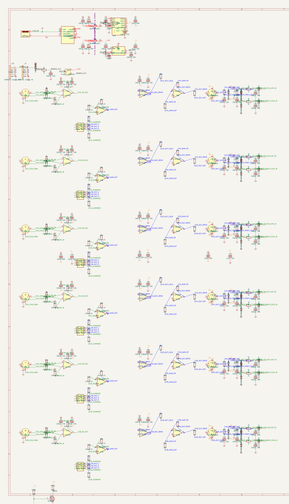
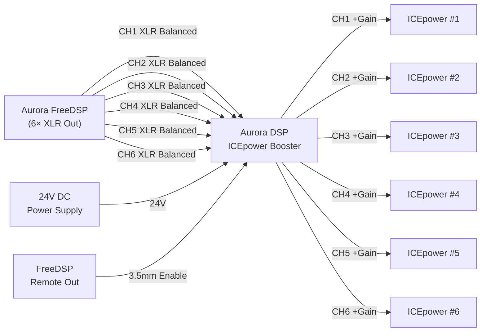
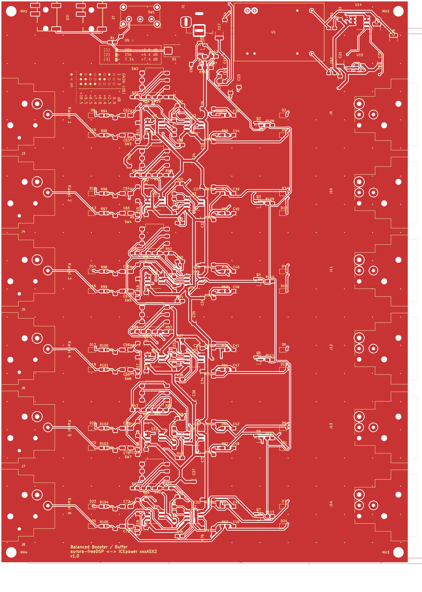

# Aurora DSP ICEpower Booster

   

**6-Channel Balanced Audio Interface** — Aurora FreeDSP → ICEpower Amplifier Modules

This board sits between an **Aurora FreeDSP DSP processor** and six **ICEpower Class-D amplifier modules**. It receives 6 balanced audio signals from the DSP, applies adjustable gain (0–11.3 dB), protects the signals, and outputs them as balanced XLR signals.



---

## Features

- **6 identical channels** — balanced XLR input & output
- **LM4562 low-noise dual op-amps** — THD+N 0.00003%, 2.7 nV/√Hz
- **0–11.3 dB gain** in 8 steps via 3-bit DIP switch per channel
- **100 ms power-on muting** — BSS138 MOSFET chain prevents pop noise
- **Remote enable** via 3.5mm jack (Aurora FreeDSP compatible)
- **Full ESD protection** — PESD5V0S1BL on all signal I/O, SMBJ15CA on remote
- **Isolated power supply** — TRACO TEL5-2422 DC/DC → ADP7118/ADP7182 LDOs (±11V)
- **JLCPCB-ready** — 2-layer FR-4, all components LCSC-available

---

## Specifications

| Parameter | Value |
|-----------|-------|
| Channels | 6 (identical) |
| Input | 6× XLR Female, Pin 2 = Hot, Pin 3 = Cold, Pin 1 = GND |
| Output | 6× XLR Male, Pin 2 = Hot, Pin 3 = Cold, Pin 1 = GND |
| Power Supply | 24V DC (Barrel Jack) |
| Op-Amp Supply | ±11V (low-noise LDO) |
| Gain Range | 0 dB to +11.3 dB (8 steps via DIP switch) |
| Input Impedance | ~10 kΩ balanced |
| Output Impedance | ~47Ω (series R) |
| Input CMRR | ~62 dB (4× 10kΩ 0.1% metal film) |
| SNR Target | > 100 dB |
| THD+N Target | < 0.01% @ 1 kHz |
| Remote Interface | KH-PJ-320EA-5P-SMT 3.5mm jack (Aurora FreeDSP Custom Out) |
| Manufacturing | JLCPCB, 2-Layer, FR-4, HASL, 145.6 × 200 mm |

---

## System Overview



---

## Signal Chain Overview

All 6 channels are **identical**. Each channel consists of 5 stages:

```mermaid
flowchart LR
    XIN["XLR IN\nJ3–J8"]
    ESD1["ESD Protection\nInput"]
    EMI["EMI Filter\n47Ω + 100pF"]
    DC["DC Blocking\n2.2µF C0G"]
    DIFF["Diff Receiver\nLM4562 Unit A"]
    GAIN["Gain Stage\nLM4562 Unit B"]
    MUTE["Muting\nBSS138"]
    DRV["Balanced Driver\nLM4562 (2nd IC)"]
    ZOB["Zobel\n10Ω + 100nF"]
    ESD2["ESD Protection\nOutput"]
    XOUT["XLR OUT\nJ9–J14"]

    XIN --> ESD1 --> EMI --> DC --> DIFF --> GAIN --> MUTE --> DRV --> ZOB --> ESD2 --> XOUT
```



| Stage | Function | Key Components |
|-------|----------|---------------|
| 1. ESD & EMI Filter | Overvoltage protection + RF filtering | PESD5V0S1BL, 47Ω + 100pF, 2.2µF C0G DC blocking |
| 2. Diff Receiver | Balanced → single-ended, CMRR ~62 dB | LM4562 Unit A, 4× 10kΩ 0.1% |
| 3. Gain Stage | Inverting amp, 0–11.3 dB adjustable | LM4562 Unit B, DIP switch + 3 parallel R |
| 4. Muting | Power-on pop suppression, τ = 100 ms | BSS138 N-MOSFET, RC timing |
| 5. Balanced Driver | Single-ended → balanced output | LM4562 (buffer + inverter), 47Ω series R, Zobel network |

**→ [Full signal chain documentation with schematics and formulas](docs/signal-chain.md)**

---

## Gain Configuration

| SW Pos 1 (30kΩ) | SW Pos 2 (15kΩ) | SW Pos 3 (7.5kΩ) | Gain (dB) |
|:---:|:---:|:---:|---:|
| OFF | OFF | OFF | 0.0 dB |
| OFF | OFF | ON | +2.5 dB |
| OFF | ON | OFF | +4.4 dB |
| OFF | ON | ON | +6.0 dB |
| ON | OFF | OFF | +7.4 dB |
| ON | OFF | ON | +8.5 dB |
| ON | ON | OFF | +9.5 dB |
| ON | ON | ON | **+11.3 dB** |

$$G = \frac{R_f}{R_{in,eff}} \quad\text{with}\quad R_{in,eff} = R_{base} \parallel R_{pos1} \parallel R_{pos2} \parallel R_{pos3}$$

**→ [Full gain configuration details](docs/gain-configuration.md)**

---

## PCB Layout

| Parameter | Value |
|-----------|-------|
| Board Size | 145.6 × 200 mm |
| Layers | 2 (F.Cu + B.Cu) |
| Footprints | 269 |
| Nets | 135 in 5 net classes |
| Routing | Freerouting v2.0.1 — 1543 segments + 476 vias |
| GND Zones | F.Cu (solid connect) + B.Cu (thermal relief) |
| DRC | 0 Errors, 0 Unconnected, 198 Warnings (cosmetic) |



| Net Class | Nets | Track Width | Clearance |
|-----------|------|-------------|-----------|
| Default | 62 | 0.25 mm | 0.2 mm |
| Audio_Input | 30 | 0.3 mm | 0.25 mm |
| Audio_Output | 36 | 0.5 mm | 0.2 mm |
| Audio_Power | 0 | 0.8 mm | 0.2 mm |
| Power | 7 | 0.5 mm | 0.2 mm |

**→ [PCB layout details & DRC breakdown](docs/pcb-layout.md)**

---

## Manufacturing

Production files are ready in the `production/` directory:

- **Gerber + Drill** — `production/gerber/` (JLCPCB format, Protel extensions, tented vias)
- **BOM + Placement** — `production/assembly/` (JLCPCB SMT assembly format)

---

## Validation

| Method | Checks | Result |
|--------|--------|--------|
| **Method 1** — OrcadPCB2 netlist, component-centric | 85/85 | ✅ |
| **Method 2** — KiCad-native netlist, net-centric (pintype/pinfunction) | 177/177 | ✅ |

> All component references, net names, and pin assignments in the documentation were extracted directly from the verified KiCad netlist and are sufficient to fully rebuild the schematic without the `.kicad_sch` file.

---

## Documentation

| Document | Description |
|----------|-------------|
| **[Signal Chain](docs/signal-chain.md)** | Detailed 5-stage signal path with Mermaid diagrams, formulas, and per-stage component tables |
| **[Power Supply](docs/power-supply.md)** | DC/DC converter, LDOs, ferrite beads, decoupling architecture |
| **[Muting & Remote Control](docs/muting-and-remote.md)** | Remote enable logic, muting timing, SPDT switch modes |
| **[Gain Configuration](docs/gain-configuration.md)** | DIP switch table, gain formula, per-channel resistor mapping |
| **[Component Reference](docs/component-reference.md)** | Complete BOM with all 242 symbols: R, C, D, J, SW, Q, U, FB |
| **[Schematic Rebuild Guide](docs/schematic-rebuild-guide.md)** | Step-by-step wiring instructions + full 6-channel component mapping |
| **[PCB Layout](docs/pcb-layout.md)** | Net classes, DRC status, routing details |
| **[Research: Balanced Audio ICs](docs/research/balanced-audio-ic-comparison.md)** | THAT1240, DRV135, SSM2143, LM4562 comparison & JLCPCB availability |
| **[Research: THT Precision Components](docs/research/tht-precision-components.md)** | 0.1% resistors, C0G capacitors, THT sourcing guide |

---

## Project Structure

This project is **self-contained** — all footprints and 3D models are included locally.

```
├── aurora-dsp-icepower-booster.kicad_pro   # Project
├── aurora-dsp-icepower-booster.kicad_sch   # Schematic
├── aurora-dsp-icepower-booster.kicad_pcb   # PCB Layout
├── aurora-dsp-icepower-booster.kicad_sym   # Local symbols
├── aurora-dsp-icepower-booster.kicad_dru   # Custom design rules
├── footprints.pretty/                      # 21 footprints (local)
│   └── 3dshapes/                           # 19 STEP 3D models
├── production/
│   ├── gerber/                             # Manufacturing data
│   └── assembly/                           # BOM + placement data
├── docs/                                   # Detailed documentation
│   ├── signal-chain.md
│   ├── power-supply.md
│   ├── muting-and-remote.md
│   ├── gain-configuration.md
│   ├── component-reference.md
│   ├── schematic-rebuild-guide.md
│   ├── pcb-layout.md
│   └── research/
│       ├── balanced-audio-ic-comparison.md
│       └── tht-precision-components.md
└── scripts/                                # Build & validation scripts
```

---

*Schematic: KiCad 9 — `aurora-dsp-icepower-booster.kicad_sch`*
*Manufacturing: JLCPCB 2-Layer FR-4 HASL — Gerber files in `production/gerber/`*
