# Aurora DSP ICEpower Booster

**6-Kanal Balanced Audio Interface** — Aurora FreeDSP → ICEpower Verstärkermodul

Dieses Board sitzt zwischen einem **Aurora FreeDSP DSP-Prozessor** und sechs **ICEpower Class-D Verstärkermodulen**. Es empfängt 6 symmetrische (balanced) Audiosignale vom DSP, verstärkt diese einstellbar um 0–11,3 dB, schützt die Signale und gibt sie wieder als symmetrische XLR-Signale aus.

---

## Inhaltsverzeichnis

1. [Spezifikationen](#spezifikationen)
2. [Systemübersicht](#systemübersicht)
3. [Signalkette — Detail](#signalkette--detail)
4. [Spannungsversorgung](#spannungsversorgung)
5. [Muting & Remote-Steuerung](#muting--remote-steuerung)
6. [Gain-Einstellung](#gain-einstellung)
7. [Vollständige Bauteil-Referenz](#vollständige-bauteil-referenz)
8. [Schematic nachbilden](#schematic-nachbilden)

---

## Spezifikationen

| Parameter | Wert |
|-----------|------|
| Kanäle | 6 (identisch) |
| Eingang | 6× XLR Female, Pin 2 = Hot, Pin 3 = Cold, Pin 1 = GND |
| Ausgang | 6× XLR Male, Pin 2 = Hot, Pin 3 = Cold, Pin 1 = GND |
| Versorgung | 24 V DC (Barrel Jack) |
| Op-Amp-Versorgung | ±11 V (Low-Noise LDO) |
| Gain-Bereich | 0 dB bis +11,3 dB (8 Stufen via DIP-Switch) |
| Eingangsimpedanz | ~10 kΩ balanced |
| Ausgangsimpedanz | ~47 Ω (Serien-R) |
| CMRR Eingang | ~62 dB (4× 10 kΩ 0,1 % Metallfilm) |
| SNR-Ziel | > 100 dB |
| THD+N-Ziel | < 0,01 % @ 1 kHz |
| Schnittstelle Remote | 3,5 mm Klinke (Aurora FreeDSP Custom Out) |
| Fertigung | JLCPCB, 2-Layer, FR-4, HASL, 200 × 200 mm |

---

## Systemübersicht

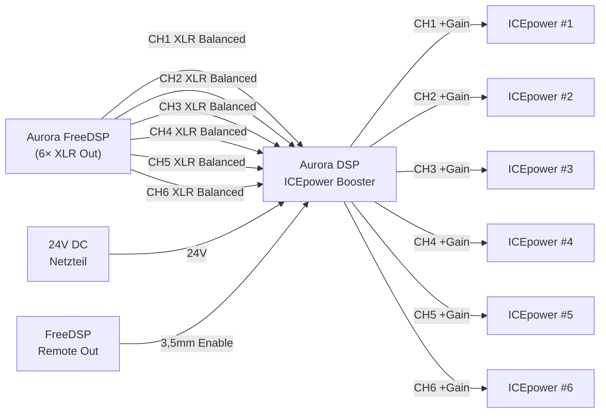

---

## Signalkette — Detail

Alle 6 Kanäle sind **identisch** aufgebaut. Die folgenden Diagramme zeigen **CH1** — für CH2–CH6 gelten dieselben Topologien mit den entsprechenden Bauteil-Nummern.

### Überblick — eine Kanalstufe

```mermaid
flowchart LR
    XIN["XLR IN\nJ3–J8"]
    ESD1["ESD-Schutz\nEingang"]
    EMI["EMI-Filter\n47Ω + 100pF"]
    DC["DC-Blocking\n2,2µF C0G"]
    DIFF["Diff-Receiver\nLM4562 Unit A"]
    GAIN["Gain-Stufe\nLM4562 Unit B"]
    MUTE["Muting\nBSS138"]
    DRV["Balanced Driver\nLM4562 (2. IC)"]
    ZOB["Zobel\n10Ω + 100nF"]
    ESD2["ESD-Schutz\nAusgang"]
    XOUT["XLR OUT\nJ9–J14"]

    XIN --> ESD1 --> EMI --> DC --> DIFF --> GAIN --> MUTE --> DRV --> ZOB --> ESD2 --> XOUT
```

---

### Stufe 1 — ESD-Schutz & EMI-Filter (Eingang)

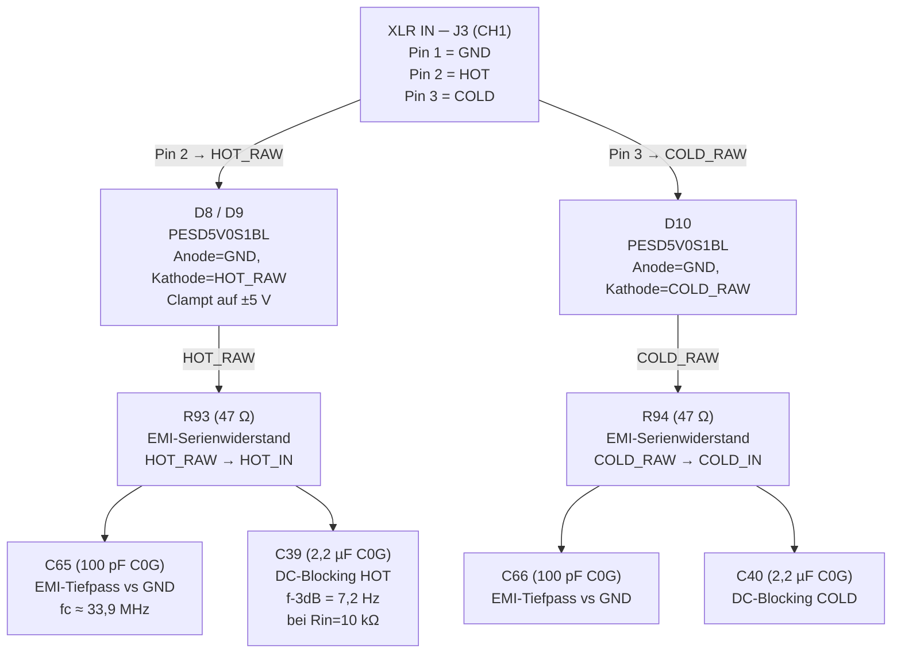

**Bauteile CH1 — ESD & Filter:**

| Ref | Wert | Funktion | Netz |
|-----|------|----------|------|
| J3 | XLR Female | Eingang CH1 | Pin1=GND, Pin2=CH1_HOT_RAW, Pin3=CH1_COLD_RAW |
| D8 | PESD5V0S1BL | ESD HOT | A=GND, K=CH1_HOT_RAW |
| D9 | PESD5V0S1BL | ESD COLD | A=GND, K=CH1_COLD_RAW |
| R93 | 47 Ω | EMI-Filter HOT | CH1_HOT_RAW → CH1_HOT_IN |
| R94 | 47 Ω | EMI-Filter COLD | CH1_COLD_RAW → CH1_COLD_IN |
| C65 | 100 pF C0G | HF-Bypass HOT | CH1_HOT_IN → GND |
| C66 | 100 pF C0G | HF-Bypass COLD | CH1_COLD_IN → GND |
| C39 | 2,2 µF C0G | DC-Blocking HOT | CH1_HOT_RAW → CH1_HOT_IN |
| C40 | 2,2 µF C0G | DC-Blocking COLD | CH1_COLD_RAW → CH1_COLD_IN |

---

### Stufe 2 — Differenzieller Receiver (LM4562 Unit A)

Der Differenz-Empfänger wandelt das balanced Signal (HOT + COLD) in ein Single-Ended Signal um und unterdrückt Gleichtaktstörungen (CMRR ~62 dB).

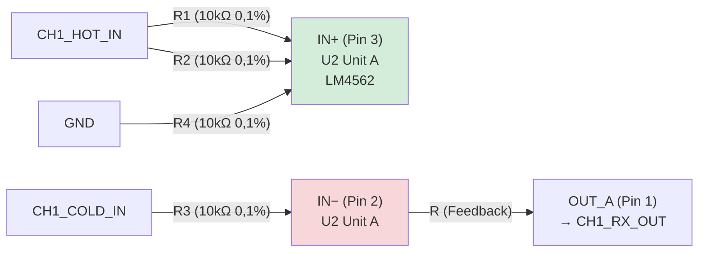

**Klassische Differenzverstärker-Formel:**

$$G_{diff} = \frac{R_f}{R_{in}} = \frac{10\,k\Omega}{10\,k\Omega} = 1 \quad (0\,\text{dB})$$

$$CMRR \approx 20 \cdot \log_{10}\!\left(\frac{2 \cdot \frac{\Delta R}{R}}{1}\right)^{-1} \approx 62\,\text{dB}$$
(bei 0,1 % Widerstandstoleranz)

**Bauteile CH1 — Differenzieller Receiver:**

| Ref | Wert | Funktion | Netz Pin 1 → Pin 2 |
|-----|------|----------|--------------------|
| U2 (Unit A) | LM4562 | Diff-Receiver | — |
| R1 | 10 kΩ 0,1% | HOT Input | CH1_HOT_RAW → CH1_HOT_IN |
| R2 | 10 kΩ 0,1% | HOT Input parallel | CH1_HOT_IN → CH1_HOT_IN |
| R3 | 10 kΩ 0,1% | COLD Input | CH1_COLD_RAW → CH1_COLD_IN |
| R4 | 10 kΩ 0,1% | Referenzwiderstand | CH1_HOT_IN → GND |

---

### Stufe 3 — Gain-Stufe (LM4562 Unit B)

Die zweite Op-Amp-Einheit (Unit B desselben LM4562) verstärkt das Signal invertierend. Die drei DIP-Switch-Widerstände werden **parallel** zum Eingangs-Widerstand R geschaltet und erniedrigen dadurch den effektiven Rin → höhere Verstärkung.

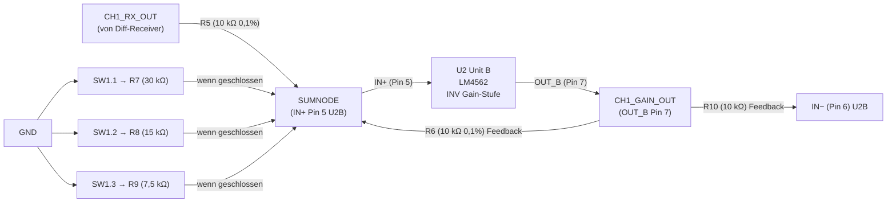

**Bauteile CH1 — Gain-Stufe:**

| Ref | Wert | Funktion | Netz Pin 1 → Pin 2 |
|-----|------|----------|--------------------|
| U2 (Unit B) | LM4562 | Gain-Verstärker | — |
| R5 | 10 kΩ 0,1% | Eingangs-R | CH1_RX_OUT → CH1_SUMNODE |
| R6 | 10 kΩ 0,1% | Feedback-R | CH1_GAIN_OUT → CH1_SUMNODE |
| R7 | 30 kΩ | DIP SW1.1 | CH1_SUMNODE → GND (via SW1) |
| R8 | 15 kΩ | DIP SW1.2 | CH1_SUMNODE → GND (via SW1) |
| R9 | 7,5 kΩ | DIP SW1.3 | CH1_SUMNODE → GND (via SW1) |
| R10 | 10 kΩ | Feedback INV | CH1_GAIN_OUT → CH1_INV_IN |
| SW1 | SW_DIP_x03 | Gain-Wahl CH1 | 3 × SPST |

---

### Stufe 4 — Muting (BSS138 MOSFET)

Beim Einschalten werden die LDOs erst nach einer RC-Verzögerung aktiviert. Solange die Versorgung stabil ist, sperren Q2–Q7 den Signalweg und verhindern Einschalt-Knackgeräusche.

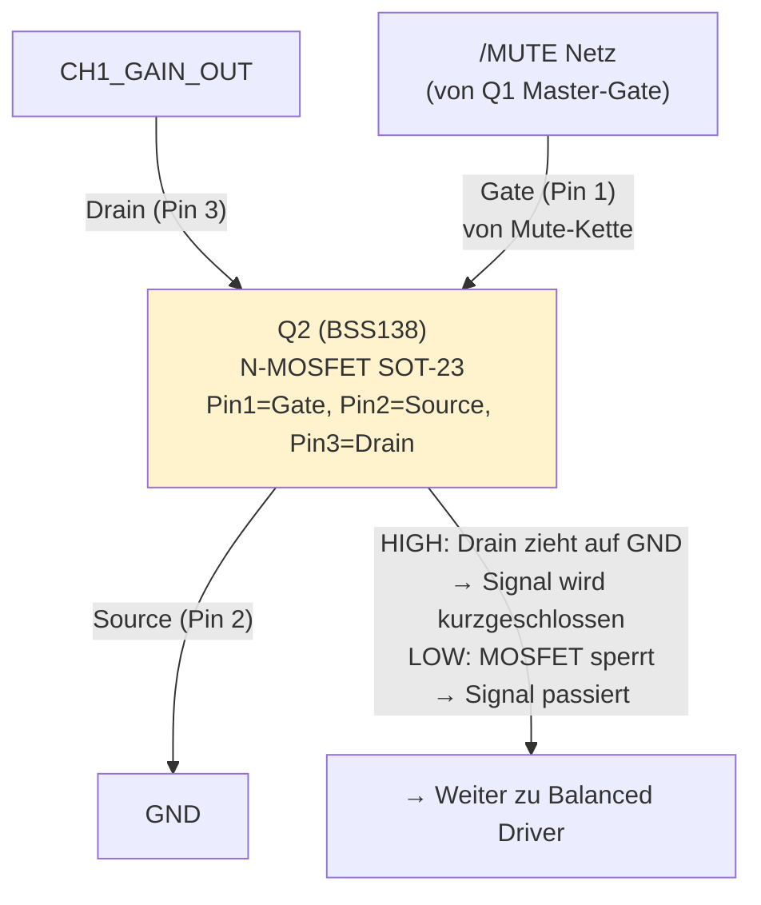

> **Hinweis:** Das Muting funktioniert durch Kurzschließen des Signals auf GND (aktiv-Muting). Wenn Q2 sperrt (Gate = LOW = LDOs noch nicht aktiv), fließt das Signal ungestört. Wenn Q2 leitet (Gate = HIGH), wird der Ausgang auf GND gezogen. Das klingt kontraintuitiv, entspricht aber der Muting-Logik: LDOs müssen aktiv sein BEVOR Audio fließen darf.

**Bauteile Muting (alle Kanäle):**

| Ref | Wert | Funktion | G → S → D |
|-----|------|----------|-----------|
| Q1 | BSS138 | Master Mute-Trigger | Net-(Q1-G) → GND → /MUTE |
| Q2 | BSS138 | Mute CH1 | /MUTE → GND → CH1_GAIN_OUT |
| Q3 | BSS138 | Mute CH2 | /MUTE → GND → CH2_GAIN_OUT |
| Q4 | BSS138 | Mute CH3 | /MUTE → GND → CH3_GAIN_OUT |
| Q5 | BSS138 | Mute CH4 | /MUTE → GND → CH4_GAIN_OUT |
| Q6 | BSS138 | Mute CH5 | /MUTE → GND → CH5_GAIN_OUT |
| Q7 | BSS138 | Mute CH6 | /MUTE → GND → CH6_GAIN_OUT |

---

### Stufe 5 — Balanced Driver (LM4562, 2. IC)

Ein separater LM4562 erzeugt aus dem Single-Ended Gain-Signal wieder ein symmetrisches (balanced) Ausgangssignal. Unit A puffert das Signal (HOT), Unit B invertiert es (COLD = −HOT).

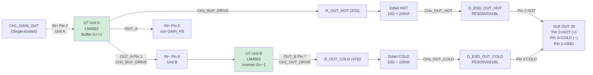

**Bauteile CH1 — Balanced Driver & Ausgang:**

| Ref | Wert | Funktion | Netz Pin 1 → Pin 2 |
|-----|------|----------|--------------------|
| U7 (Unit A) | LM4562 | HOT-Buffer | GAIN_OUT → BUF_DRIVE |
| U7 (Unit B) | LM4562 | COLD-Inverter | BUF_DRIVE → OUT_DRIVE |
| R12 | 47 Ω | Serien-R HOT out | BUF_DRIVE → CH1_OUT_HOT |
| R81 | 10 Ω | Zobel R (HOT) | CH1_OUT_HOT — |
| C71..C73* | 100 nF | Zobel C (HOT) | CH1_OUT_HOT → GND |
| R58* | 47 Ω | Serien-R COLD out | OUT_DRIVE → CH1_OUT_COLD |
| R88 | 10 Ω | Zobel R (COLD) | CH1_OUT_COLD — |
| C*| 100 nF | Zobel C (COLD) | CH1_OUT_COLD → GND |
| D2 | PESD5V0S1BL | ESD OUT_HOT | A=GND, K=CH1_OUT_HOT |
| D3 | PESD5V0S1BL | ESD OUT_COLD | A=GND, K=CH1_OUT_COLD |
| J9 | XLR Male | Ausgang CH1 | Pin1=GND, Pin2=CH1_OUT_HOT, Pin3=CH1_OUT_COLD |

---

### Vollständige Signalkette CH1 (alle Netz-Namen)

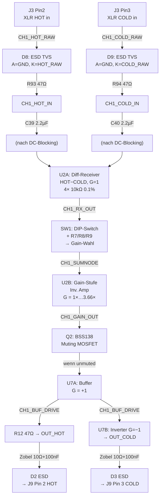

---

## Spannungsversorgung

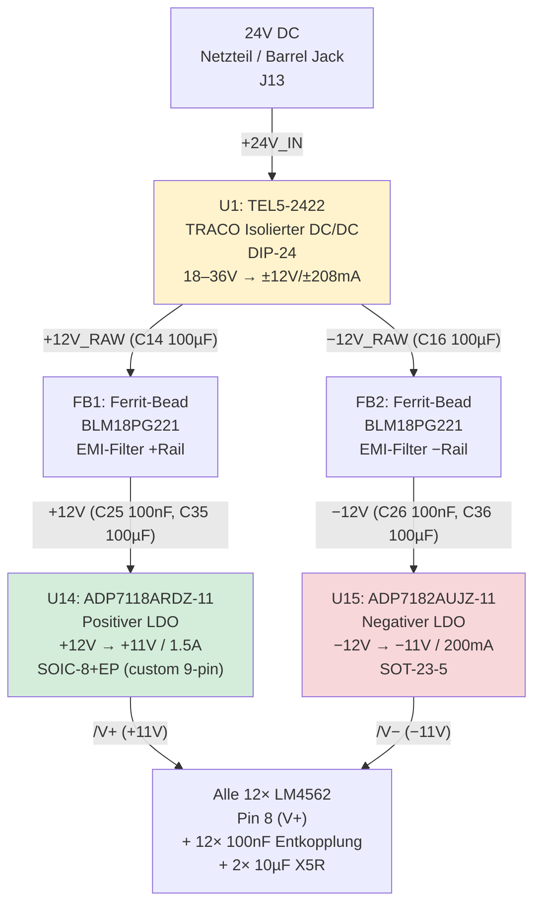

**Bauteile Spannungsversorgung:**

| Ref | Wert | Funktion | Vin → Vout |
|-----|------|----------|-----------|
| J13 | 24V DC Barrel Jack | Eingang | 24V extern |
| U1 | TEL5-2422 | Isolierter DC/DC, DIP-24 | +24V → ±12V, 5W |
| C14 | 100 µF/25V | +12V_RAW Bulk | — |
| C16 | 100 µF/25V | −12V_RAW Bulk | — |
| FB1 | BLM18PG221 | Ferrit +Rail | +12V_RAW → /+12V |
| FB2 | BLM18PG221 | Ferrit −Rail | −12V_RAW → /−12V |
| C25 | 100 nF C0G | Eingangsfilter U14 | /+12V → GND |
| C26 | 100 nF C0G | Eingangsfilter U15 | /−12V → GND |
| C35 | 100 µF/25V | Eingangs-Bulk U14 | /+12V → GND |
| C36 | 100 µF/25V | Eingangs-Bulk U15 | /−12V → GND |
| U14 | ADP7118ARDZ-11 | Positiver LDO | /+12V → /V+ (+11V), EN=EN_CTRL |
| U15 | ADP7182AUJZ-11 | Negativer LDO | /−12V → /V− (−11V), EN=EN_CTRL |
| C37 | 10 µF X5R | Ausgangs-Bulk U14 | /V+ → GND |
| C38 | 10 µF X5R | Ausgangs-Bulk U15 | /V− → GND |
| C81 | 100 nF C0G | Soft-Start U14 (SS-Pin) | /SS_U14 → GND |
| C82 | 100 nF C0G | Noise-Reduction U15 (NR-Pin) | /NR_U15 → GND |
| C51 | 100 µF | V+ Ausgang Bulk | /V+ → GND |
| C52 | 100 µF | V− Ausgang Bulk | /V− → GND |

**Pro LM4562 (12× identisch):**

| Ref (Muster) | Wert | Funktion |
|---|---|---|
| C1–C12 | 100 nF C0G | V+ Entkopplung Op-Amp (Pin 8) |
| C2–C13* | 100 nF C0G | V− Entkopplung Op-Amp (Pin 4) |

> *Die genauen Kondensatornummern pro Op-Amp-IC sind aus dem Schaltplan zu entnehmen (je 2 × 100 nF direkt an Pin 8 und Pin 4 jedes LM4562).

---

## Muting & Remote-Steuerung

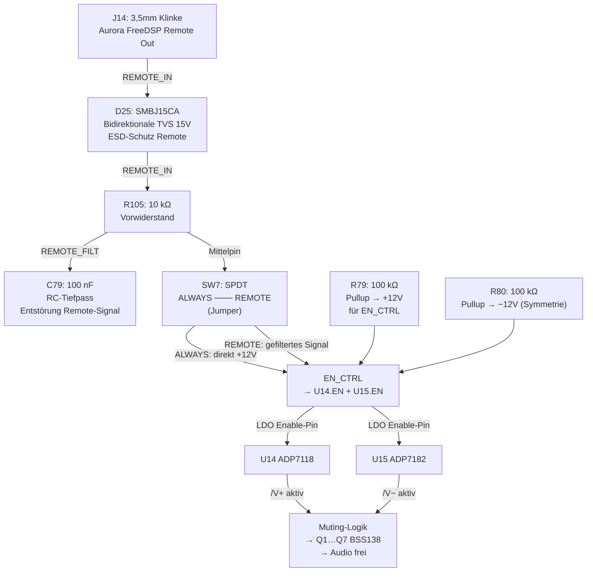

**Funktionsweise:**

- **SW7 = ALWAYS:** EN_CTRL liegt auf HIGH (Pullup R79/R80) → LDOs immer aktiv → Board immer betriebsbereit
- **SW7 = REMOTE:** EN_CTRL folgt dem FreeDSP Remote-Signal (J14) über R-C-Filter → Board schaltet sich mit dem DSP ein/aus
- **D25 (SMBJ15CA):** Schützt den Remote-Eingang vor Überspannungen bis ±15V (bidirektional)

**Bauteile Remote & Muting:**

| Ref | Wert | Funktion | Netz |
|-----|------|----------|------|
| J14 | 3,5mm Klinke | Remote-Eingang | REMOTE_IN |
| D25 | SMBJ15CA | ESD Remote 15V bidi | A+K = REMOTE_IN |
| R105 | 10 kΩ | RC-Vorwiderstand | REMOTE_IN → REMOTE_FILT |
| C79 | 100 nF C0G | RC-Tiefpass | REMOTE_FILT → GND |
| SW7 | SW_SPDT | ALWAYS/REMOTE Wahl | Pins: A=REMOTE_FILT, COM=EN_CTRL |
| R79 | 100 kΩ | Pullup +12V | /+12V → EN_CTRL |
| R80 | 100 kΩ | Pullup sym. | EN_CTRL → GND (oder −12V) |

---

## Gain-Einstellung

### DIP-Switch Tabelle (SW1–SW6, identisch pro Kanal)

Jeder Kanal hat einen **3-poligen DIP-Switch** (SW1 = CH1, SW2 = CH2, …, SW6 = CH6).
Die drei Positionen schalten Widerstände **parallel** zum Eingangs-Widerstand der Gain-Stufe. Mehr aktive Schalter = niedrigerer Rin_eff = höhere Verstärkung.

| SW Pos 3 (30kΩ) | SW Pos 2 (15kΩ) | SW Pos 1 (7,5kΩ) | Rin_eff | Gain (×) | Gain (dB) |
|:---:|:---:|:---:|---:|---:|---:|
| OFF | OFF | OFF | 10,00 kΩ | 1,00 | 0,0 dB |
| OFF | OFF | ON | 7,50 kΩ | 1,33 | +2,5 dB |
| OFF | ON | OFF | 6,00 kΩ | 1,67 | +4,4 dB |
| OFF | ON | ON | 5,00 kΩ | 2,00 | +6,0 dB |
| ON | OFF | OFF | 4,29 kΩ | 2,33 | +7,4 dB |
| ON | OFF | ON | 3,75 kΩ | 2,67 | +8,5 dB |
| ON | ON | OFF | 3,33 kΩ | 3,00 | +9,5 dB |
| ON | ON | ON | 2,73 kΩ | 3,66 | **+11,3 dB** |

**Formel:**
$$G = 1 + \frac{R_f}{R_{in,eff}} \quad\text{mit}\quad R_{in,eff} = R_{base} \parallel R_{SW1} \parallel R_{SW2} \parallel R_{SW3}$$

$$R_{in,base} = 10\,k\Omega,\quad R_f = R_{10} = 10\,k\Omega$$

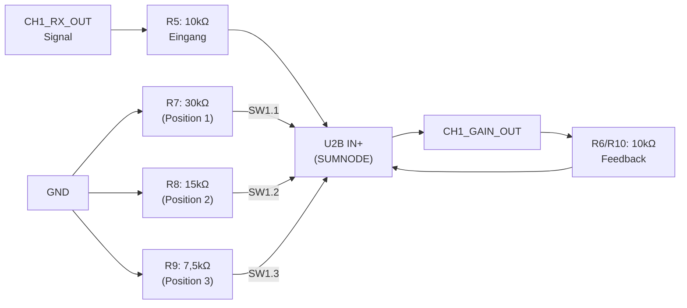

---

## Vollständige Bauteil-Referenz

### Op-Amps: LM4562 (U2–U13)

12× Dual-Op-Amp SOIC-8. Pro LM4562: **Unit A** und **Unit B** (je 1 Op-Amp).

| Ref | Unit A Funktion | Unit B Funktion | V+ auf | V− auf |
|-----|----------------|----------------|-------|-------|
| U2 | CH1 Diff-Receiver | CH1 Gain-Stufe | /V+ | /V− |
| U3 | CH2 Diff-Receiver | CH2 Gain-Stufe | /V+ | /V− |
| U4 | CH3 Diff-Receiver | CH3 Gain-Stufe | /V+ | /V− |
| U5 | CH4 Diff-Receiver | CH4 Gain-Stufe | /V+ | /V− |
| U6 | CH5 Diff-Receiver | CH5 Gain-Stufe | /V+ | /V− |
| U7 | CH6 Diff-Receiver | CH6 Gain-Stufe | /V+ | /V− |
| U8 | CH1 HOT-Buffer | CH1 COLD-Inverter | /V+ | /V− |
| U9 | CH2 HOT-Buffer | CH2 COLD-Inverter | /V+ | /V− |
| U10 | CH3 HOT-Buffer | CH3 COLD-Inverter | /V+ | /V− |
| U11 | CH4 HOT-Buffer | CH4 COLD-Inverter | /V+ | /V− |
| U12 | CH5 HOT-Buffer | CH5 COLD-Inverter | /V+ | /V− |
| U13 | CH6 HOT-Buffer | CH6 COLD-Inverter | /V+ | /V− |

**LM4562 SOIC-8 Pinout:**

```
        ┌───────────┐
OUT_A ──┤ 1       8 ├── V+
IN−_A ──┤ 2       7 ├── OUT_B
IN+_A ──┤ 3       6 ├── IN+_B
   V− ──┤ 4       5 ├── IN−_B
        └───────────┘
```

---

### Widerstände (R)

#### Eingangs-Netzwerk (pro Kanal, 4 Widerstände, 0,1% Metallfilm)

| CH | R_HOT_1 | R_HOT_2 | R_COLD | R_REF | Netz |
|----|---------|---------|--------|-------|------|
| 1 | R1 | R2 | R3 | R4 | HOT_IN, COLD_IN, GND |
| 2 | R14 | R15 | R16 | R17 | wie CH1 |
| 3 | R27 | R28 | R29 | R30 | wie CH1 |
| 4 | R40 | R41 | R42 | R43 | wie CH1 |
| 5 | R53 | R54 | R55 | R56 | wie CH1 |
| 6 | R66 | R67 | R68 | R69 | wie CH1 |

Alle: **10 kΩ 0,1% Metallfilm** (MELF oder 0805)

#### Gain-Netzwerk (pro Kanal, 5 Widerstände + Feedback)

| CH | R_IN (SUMNODE) | R_FB | R_SW1 | R_SW2 | R_SW3 |
|----|---------------|------|-------|-------|-------|
| 1 | R5 | R6/R10 | R9 (7,5k) | R8 (15k) | R7 (30k) |
| 2 | R18 | R19/R23 | R22 (7,5k) | R21 (15k) | R20 (30k) |
| 3 | R31 | R32/R36 | R35 (7,5k) | R34 (15k) | R33 (30k) |
| 4 | R44 | R45/R49 | R48 (7,5k) | R47 (15k) | R46 (30k) |
| 5 | R57 | R58/R62 | R61 (7,5k) | R60 (15k) | R59 (30k) |
| 6 | R70 | R71/R75 | R74 (7,5k) | R73 (15k) | R72 (30k) |

#### EMI-Eingangsfilter — Serien-Widerstände (47 Ω, 2× pro Kanal)

| CH | R_HOT | R_COLD | Netz |
|----|-------|--------|------|
| 1 | R93 | R94 | HOT/COLD_RAW → HOT/COLD_IN |
| 2 | R95 | R96 | wie CH1 |
| 3 | R97 | R98 | wie CH1 |
| 4 | R99 | R100 | wie CH1 |
| 5 | R101 | R102 | wie CH1 |
| 6 | R103 | R104 | wie CH1 |

#### Zobel-Netzwerk — Serien-Widerstände am Ausgang (10 Ω)

| CH | R_HOT_OUT | R_COLD_OUT |
|----|-----------|-----------|
| 1 | R81 | R82 |
| 2 | R83 | R84 |
| 3 | R85 | R86 |
| 4 | R87 | R88 |
| 5 | R89 | R90 |
| 6 | R91 | R92 |

#### Ausgangs-Serien-Widerstände (47 Ω, Ausgangs-XLR)

| CH | R_HOT | R_COLD |
|----|-------|--------|
| 1 | R12 | R13* |
| 2 | R25 | R26* |
| 3 | R38 | R39* |
| 4 | R51 | R52* |
| 5 | R64 | R65* |
| 6 | R77 | R78* |

#### Sonstige Widerstände

| Ref | Wert | Funktion | Netz |
|-----|------|----------|------|
| R79 | 100 kΩ | Pullup EN_CTRL | /+12V → EN_CTRL |
| R80 | 100 kΩ | Pullup sym. | EN_CTRL → GND |
| R105 | 10 kΩ | Remote RC-Filter | REMOTE_IN → REMOTE_FILT |

---

### Kondensatoren (C)

#### DC-Blocking (2,2 µF C0G, je 2 pro Kanal = 12×)

| CH | C_HOT | C_COLD |
|----|-------|--------|
| 1 | C39 | C40 |
| 2 | C41 | C42 |
| 3 | C43 | C44 |
| 4 | C45 | C46 |
| 5 | C47 | C48 |
| 6 | C49 | C50 |

#### EMI-HF-Filter (100 pF C0G, je 2 pro Kanal = 12×)

| CH | C_HOT | C_COLD |
|----|-------|--------|
| 1 | C65 | C66 |
| 2 | C67 | C68 |
| 3 | C69 | C70 |
| 4 | C71 | C72 |
| 5 | C73 | C74 |
| 6 | C75 | C76 |

#### Entkopplung Op-Amp (100 nF C0G, je 2× pro LM4562 = 24×)

C1–C24: Je 100 nF C0G an V+ und V− jedes LM4562 (direkt an Pin 8 bzw. Pin 4).

#### Zobel-Kondensatoren (100 nF C0G, Ausgangsfilter)

Weitere 12× 100 nF an den Zobel-Kreisen (je HOT und COLD, 6 Kanäle) — genaue Referenznummern: Teil der C1–C24 Serie oder höhere Nummern (aus Schaltplan entnehmen).

#### Versorgung Bulk & Filter (73 Kondensatoren gesamt)

| Ref | Wert | Funktion | Netz |
|-----|------|----------|------|
| C14 | 100 µF/25V | +12V_RAW Bulk (DC/DC Out) | /+12V_RAW → GND |
| C16 | 100 µF/25V | −12V_RAW Bulk | /−12V_RAW → GND |
| C25 | 100 nF C0G | U14 VIN-Bypass | /+12V → GND |
| C26 | 100 nF C0G | U15 VIN-Bypass | /−12V → GND |
| C35 | 100 µF/25V | U14 VIN-Bulk | /+12V → GND |
| C36 | 100 µF/25V | U15 VIN-Bulk | /−12V → GND |
| C37 | 10 µF X5R | U14 VOUT-Bulk | /V+ → GND |
| C38 | 10 µF X5R | U15 VOUT-Bulk | /V− → GND |
| C51 | 100 µF | V+ Board-Bulk | /V+ → GND |
| C52 | 100 µF | V− Board-Bulk | /V− → GND |
| C77 | 100 nF C0G | DC/DC +12V Bypass | /+12V → GND |
| C78 | 100 nF C0G | DC/DC −12V Bypass | /−12V → GND |
| C79 | 100 nF C0G | Remote RC-Filter | REMOTE_FILT → GND |
| C81 | 100 nF C0G | U14 Soft-Start (SS) | /SS_U14 → GND |
| C82 | 100 nF C0G | U15 Noise-Reduction (NR) | /NR_U15 → GND |

---

### Dioden (D)

#### ESD-Schutz Signalleitungen (24× PESD5V0S1BL, SOD-323)

Je **4 Dioden pro Kanal** (HOT_RAW, COLD_RAW, OUT_HOT, OUT_COLD):

| CH | D_HOT_RAW | D_COLD_RAW | D_OUT_HOT | D_OUT_COLD |
|----|-----------|-----------|----------|---------|
| 1 | D8 | D9 | D2 | D3 |
| 2 | D11 | D13 | D4* | D5* |
| 3 | D14 | D16 | D6* | D7* |
| 4 | D17 | D19 | D10* | D12* |
| 5 | D20 | D22 | D15* | D18* |
| 6 | D23 | D24 | D21* | D25* |

> *Genaue Zuordnung aus Schaltplan entnehmen — Kathode zeigt auf Signalnetz, Anode auf GND.

**PESD5V0S1BL Pinout (SOD-323):**

```
  GND ─── A │SOD-323│ K ─── Signalnetz
```

#### Remote-Schutz (1× SMBJ15CA, SMB)

| Ref | Wert | Funktion | Netz |
|-----|------|----------|------|
| D1 | SMBJ15CA | Bidirektionale TVS 15V | K1=REMOTE_IN, K2=REMOTE_IN (bidi) |

---

### Steckverbinder (J)

| Ref | Wert | Typ | Funktion |
|-----|------|-----|----------|
| J3 | XLR_IN_1 | XLR-F 3pol | Eingang CH1 |
| J4 | XLR_IN_2 | XLR-F 3pol | Eingang CH2 |
| J5 | XLR_IN_3 | XLR-F 3pol | Eingang CH3 |
| J6 | XLR_IN_4 | XLR-F 3pol | Eingang CH4 |
| J7 | XLR_IN_5 | XLR-F 3pol | Eingang CH5 |
| J8 | XLR_IN_6 | XLR-F 3pol | Eingang CH6 |
| J9 | XLR3_OUT | XLR-M 3pol | Ausgang CH1 |
| J10 | XLR3_OUT | XLR-M 3pol | Ausgang CH2 |
| J11 | XLR3_OUT | XLR-M 3pol | Ausgang CH3 |
| J12 | XLR3_OUT | XLR-M 3pol | Ausgang CH4 |
| J13 | XLR3_OUT | XLR-M 3pol | Ausgang CH5 |
| J14 | XLR3_OUT | XLR-M 3pol | Ausgang CH6 |
| J1* | 24V DC | Barrel Jack | 24V Versorgungseingang |
| J2* | REMOTE 3,5mm | Audiobuchse | Remote-Eingang (FreeDSP) |

> *Genaue Ref-Nummern aus Schaltplan — J1/J2 im Netlist für DC und Remote.

---

### Schalter (SW)

| Ref | Wert | Typ | Funktion |
|-----|------|-----|----------|
| SW1 | Gain CH1 | SW_DIP_x03 | Gain-Wahl CH1 (3 Bit) |
| SW2 | Gain CH2 | SW_DIP_x03 | Gain-Wahl CH2 |
| SW3 | Gain CH3 | SW_DIP_x03 | Gain-Wahl CH3 |
| SW4 | Gain CH4 | SW_DIP_x03 | Gain-Wahl CH4 |
| SW5 | Gain CH5 | SW_DIP_x03 | Gain-Wahl CH5 |
| SW6 | Gain CH6 | SW_DIP_x03 | Gain-Wahl CH6 |
| SW7 | ALWAYS/REMOTE | SW_SPDT | Betriebsmodus EN_CTRL |

---

### MOSFETs (Q)

Alle BSS138, N-Kanal, SOT-23. **Pinout:** Pin 1 = Gate, Pin 2 = Source, Pin 3 = Drain

| Ref | Funktion | Gate | Source | Drain |
|-----|----------|------|--------|-------|
| Q1 | Master Mute-Trigger | Net-(Q1-G) | GND | /MUTE |
| Q2 | Mute CH1 | /MUTE | GND | CH1_GAIN_OUT |
| Q3 | Mute CH2 | /MUTE | GND | CH2_GAIN_OUT |
| Q4 | Mute CH3 | /MUTE | GND | CH3_GAIN_OUT |
| Q5 | Mute CH4 | /MUTE | GND | CH4_GAIN_OUT |
| Q6 | Mute CH5 | /MUTE | GND | CH5_GAIN_OUT |
| Q7 | Mute CH6 | /MUTE | GND | CH6_GAIN_OUT |

---

## Schematic nachbilden

Diese Anleitung beschreibt die minimalen Verbindungen, um den Schaltplan von Grund auf nachzubauen. **Alle 6 Kanäle sind identisch** — CH1 vollständig aufbauen, für CH2–CH6 mit entsprechenden Bauteil-Nummern wiederholen.

### Schritt 1 — Versorgung

```
1.  U1 (TEL5-2422, DIP-24) platzieren
    Pin 22, 23 → /+24V_IN (Barrel-Jack J13 Plus)
    Pin 14     → /+12V_RAW
    Pin 11     → /−12V_RAW
    Pin 2,3,9,16 → GND

2.  C14 (100µF) zwischen /+12V_RAW und GND
    C16 (100µF) zwischen /−12V_RAW und GND
    C77 (100nF) zwischen /+12V und GND (nach FB)
    C78 (100nF) zwischen /−12V und GND

3.  FB1 (Ferrit) in Serie: /+12V_RAW → /+12V
    FB2 (Ferrit) in Serie: /−12V_RAW → /−12V

4.  U14 (ADP7118ARDZ, SOIC-8+EP)
    Pin 7,8 (VIN) → /+12V
    Pin 1,2,3 (VOUT) → /V+
    Pin 4,9 (GND) → GND
    Pin 5 (EN) → /EN_CTRL
    Pin 6 (SS) → C81 (100nF) → GND

5.  U15 (ADP7182AUJZ, SOT-23-5)
    Pin 2 (VIN) → /−12V
    Pin 5 (VOUT) → /V−
    Pin 1 (GND) → GND
    Pin 3 (EN) → /EN_CTRL
    Pin 4 (NR) → C82 (100nF) → GND

6.  C35,C36 (je 100µF) an VIN der LDOs
    C37,C38 (je 10µF) an VOUT der LDOs
    C51 (100µF) /V+ → GND
    C52 (100µF) /V− → GND
```

### Schritt 2 — Enable & Muting

```
7.  R79 (100kΩ): /+12V → /EN_CTRL
    R80 (100kΩ): /EN_CTRL → GND

8.  SW7 (SPDT):
    - Kontakt A → /REMOTE_FILT (Remote-Eingang)
    - Mittelkontakt → /EN_CTRL
    - (ALWAYS: Mittelkontakt direkt auf HIGH via R79)

9.  J14 (3,5mm) → D25 (SMBJ15CA) → /REMOTE_IN
    /REMOTE_IN → R105 (10kΩ) → /REMOTE_FILT
    /REMOTE_FILT → C79 (100nF) → GND

10. Q1 (BSS138): Gate=Net-(Q1-G), Source=GND, Drain=/MUTE
    (Gate-Netz liegt über RC-Verzögerung an EN_CTRL oder /V+)
```

### Schritt 3 — Eingangsschutz CH1 (wiederholen für CH2–CH6)

```
11. J3 (XLR Female, CH1):
    Pin 1 → GND
    Pin 2 → /CH1_HOT_RAW
    Pin 3 → /CH1_COLD_RAW

12. D8 (PESD5V0S1BL): A=GND, K=/CH1_HOT_RAW
    D9 (PESD5V0S1BL): A=GND, K=/CH1_COLD_RAW

13. R93 (47Ω): /CH1_HOT_RAW → /CH1_HOT_IN
    C65 (100pF): /CH1_HOT_IN → GND
    C39 (2,2µF): /CH1_HOT_RAW ─┤├─ /CH1_HOT_IN  ←── DC-Blocking

    R94 (47Ω): /CH1_COLD_RAW → /CH1_COLD_IN
    C66 (100pF): /CH1_COLD_IN → GND
    C40 (2,2µF): /CH1_COLD_RAW ─┤├─ /CH1_COLD_IN
```

### Schritt 4 — Differenzieller Receiver CH1 (U2 Unit A)

```
14. R1 (10kΩ 0,1%): /CH1_HOT_IN → IN+_A (Pin 3 U2)
    R2 (10kΩ 0,1%): (parallel zu R1) /CH1_HOT_IN → IN+_A
    R4 (10kΩ 0,1%): IN+_A (Pin 3) → GND  ← Referenz

    R3 (10kΩ 0,1%): /CH1_COLD_IN → IN−_A (Pin 2 U2)
    R_fb_rx:        OUT_A (Pin 1) → IN−_A (Pin 2)  ← Feedback

    U2 Pin 8 (V+) → /V+,  Pin 4 (V−) → /V−
    Entkopplung: 100nF von Pin 8 → GND, 100nF von Pin 4 → GND

    OUT_A (Pin 1) = /CH1_RX_OUT
```

### Schritt 5 — Gain-Stufe CH1 (U2 Unit B)

```
15. R5 (10kΩ 0,1%): /CH1_RX_OUT → /CH1_SUMNODE
    R6 (10kΩ 0,1%): /CH1_GAIN_OUT → /CH1_SUMNODE  ← Feedback

    SW1 (DIP 3pol):
      SW1.1 → R9 (7,5kΩ): /CH1_SUMNODE → GND
      SW1.2 → R8 (15kΩ):  /CH1_SUMNODE → GND
      SW1.3 → R7 (30kΩ):  /CH1_SUMNODE → GND

    /CH1_SUMNODE → IN+_B (Pin 5 U2)
    R10 (10kΩ): /CH1_GAIN_OUT → IN−_B (Pin 6 U2)  ← Feedback
    OUT_B (Pin 7 U2) = /CH1_GAIN_OUT
```

### Schritt 6 — Muting CH1

```
16. Q2 (BSS138):
    Gate (Pin 1) → /MUTE
    Source (Pin 2) → GND
    Drain (Pin 3) → /CH1_GAIN_OUT
```

### Schritt 7 — Balanced Driver CH1 (U8)

```
17. U8 Unit A (Buffer HOT):
    IN+_A (Pin 3) → /CH1_GAIN_OUT
    IN−_A (Pin 2) → OUT_A (Pin 1)  ← Unity-Feedback (Buffer)
    OUT_A (Pin 1) = /CH1_BUF_DRIVE

18. U8 Unit B (Inverter COLD):
    IN+_B (Pin 5) → /CH1_GAIN_OUT (über Spannungsteiler oder direkt)
    IN−_B (Pin 6) → /CH1_BUF_DRIVE  ← Feedback vom Buffer
    OUT_B (Pin 7) = /CH1_OUT_DRIVE

    U8 Pin 8 (V+) → /V+,  Pin 4 (V−) → /V−
```

### Schritt 8 — Ausgang CH1

```
19. R12 (47Ω): /CH1_BUF_DRIVE → /CH1_OUT_HOT
    R81 (10Ω) + C_zobel (100nF): Zobel an /CH1_OUT_HOT → GND

    R58 (47Ω): /CH1_OUT_DRIVE → /CH1_OUT_COLD
    R82 (10Ω) + C_zobel (100nF): Zobel an /CH1_OUT_COLD → GND

20. D2 (PESD5V0S1BL): A=GND, K=/CH1_OUT_HOT
    D3 (PESD5V0S1BL): A=GND, K=/CH1_OUT_COLD

21. J9 (XLR Male, CH1):
    Pin 1 → GND
    Pin 2 → /CH1_OUT_HOT
    Pin 3 → /CH1_OUT_COLD
```

---

### Bauteil-Mapping alle 6 Kanäle

| Bauteile | CH1 | CH2 | CH3 | CH4 | CH5 | CH6 |
|----------|-----|-----|-----|-----|-----|-----|
| **XLR IN** | J3 | J4 | J5 | J6 | J7 | J8 |
| **XLR OUT** | J9 | J10 | J11 | J12 | J13 | J14 |
| **ESD IN HOT** | D8 | D11 | D14 | D17 | D20 | D23 |
| **ESD IN COLD** | D9 | D13 | D16 | D19 | D22 | D24 |
| **ESD OUT HOT** | D2 | D4 | D6 | D10 | D15 | D21 |
| **ESD OUT COLD** | D3 | D5 | D7 | D12 | D18 | D25* |
| **EMI R HOT** | R93 | R95 | R97 | R99 | R101 | R103 |
| **EMI R COLD** | R94 | R96 | R98 | R100 | R102 | R104 |
| **DC-Block HOT** | C39 | C41 | C43 | C45 | C47 | C49 |
| **DC-Block COLD** | C40 | C42 | C44 | C46 | C48 | C50 |
| **Diff Receiver IC** | U2 | U3 | U4 | U5 | U6 | U7 |
| **Driver IC** | U8 | U9 | U10 | U11 | U12 | U13 |
| **Muting MOSFET** | Q2 | Q3 | Q4 | Q5 | Q6 | Q7 |
| **DIP-Switch** | SW1 | SW2 | SW3 | SW4 | SW5 | SW6 |
| **R_HOT_IN (1)** | R1 | R14 | R27 | R40 | R53 | R66 |
| **R_HOT_IN (2)** | R2 | R15 | R28 | R41 | R54 | R67 |
| **R_COLD_IN** | R3 | R16 | R29 | R42 | R55 | R68 |
| **R_REF** | R4 | R17 | R30 | R43 | R56 | R69 |
| **R_IN (Gain)** | R5 | R18 | R31 | R44 | R57 | R70 |
| **R_FB (Gain)** | R6 | R19 | R32 | R45 | R58 | R71 |
| **R_30k** | R7 | R20 | R33 | R46 | R59 | R72 |
| **R_15k** | R8 | R21 | R34 | R47 | R60 | R73 |
| **R_7.5k** | R9 | R22 | R35 | R48 | R61 | R74 |
| **R_FB2** | R10 | R23 | R36 | R49 | R62 | R75 |
| **R_47Ω OUT HOT** | R12 | R25 | R38 | R51 | R64 | R77 |
| **R_47Ω OUT COLD** | R13 | R26 | R39 | R52 | R65 | R78 |
| **R_10Ω Zobel HOT** | R81 | R83 | R85 | R87 | R89 | R91 |
| **R_10Ω Zobel COLD** | R82 | R84 | R86 | R88 | R90 | R92 |

---

## Validierungsstatus

Dieses Design wurde mit zwei unabhängigen automatisierten Methoden validiert:

| Methode | Prüfungen | Ergebnis |
|---------|-----------|----------|
| **Methode 1** — OrcadPCB2-Netlist, komponentenzentriert | 85/85 | ✅ |
| **Methode 2** — KiCad-native Netlist, netzzentriert (pintype/pinfunction) | 177/177 | ✅ |

Validierungs-Skripte: [`scripts/validate_final.py`](scripts/validate_final.py) und [`scripts/validate_netcentric.py`](scripts/validate_netcentric.py)

---

*Schaltplan: KiCad 9 — `aurora-dsp-icepower-booster.kicad_sch`*
*Fertigung: JLCPCB 2-Layer FR-4 HASL — Gerber-Dateien in `production/gerber/`*
