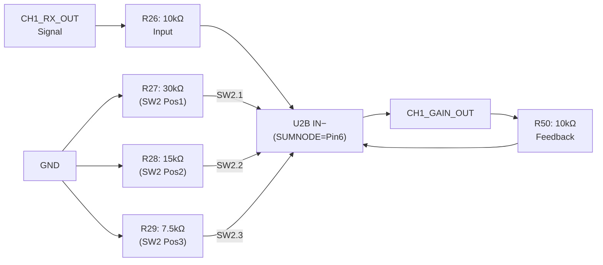

# Gain Configuration

[← Back to README](../README.md) | [Signal Chain](signal-chain.md) | [Component Reference](component-reference.md)

---

## DIP Switch Table (SW2–SW7, identical per channel)

Each channel has a **3-position DIP switch** (SW2 = CH1, SW3 = CH2, …, SW7 = CH6).
The three positions switch resistors **in parallel** with the gain stage input resistor. More active switches = lower Rin_eff = higher gain.

> **Position assignment:** Pos1 (pin1/pin6) = 30kΩ, Pos2 (pin2/pin5) = 15kΩ, Pos3 (pin3/pin4) = 7.5kΩ.

| SW Pos 1 (30kΩ) | SW Pos 2 (15kΩ) | SW Pos 3 (7.5kΩ) | Rin_eff | Gain (×) | Gain (dB) |
|:---:|:---:|:---:|---:|---:|---:|
| OFF | OFF | OFF | 10.00 kΩ | 1.00 | 0.0 dB |
| OFF | OFF | ON | 7.50 kΩ | 1.33 | +2.5 dB |
| OFF | ON | OFF | 6.00 kΩ | 1.67 | +4.4 dB |
| OFF | ON | ON | 5.00 kΩ | 2.00 | +6.0 dB |
| ON | OFF | OFF | 4.29 kΩ | 2.33 | +7.4 dB |
| ON | OFF | ON | 3.75 kΩ | 2.67 | +8.5 dB |
| ON | ON | OFF | 3.33 kΩ | 3.00 | +9.5 dB |
| ON | ON | ON | 2.73 kΩ | 3.66 | **+11.3 dB** |

**Formula:**
$$G = \frac{R_f}{R_{in,eff}} \quad\text{with}\quad R_{in,eff} = R_{base} \parallel R_{pos1} \parallel R_{pos2} \parallel R_{pos3}$$

$$R_{in,base} = R26 = 10\,k\Omega,\quad R_f = R50 = 10\,k\Omega$$

---

## Circuit Diagram

---

## Gain Network — Per-Channel Component Mapping

| CH | Rin (RX→SUMNODE) | Rf (GAIN_OUT→SUMNODE) | R_30k (SW Pos1) | R_15k (SW Pos2) | R_7.5k (SW Pos3) | DIP Switch |
|----|-----------------|----------------------|----------------|----------------|------------------|------------|
| 1 | R26 | R50 | R27 | R28 | R29 | SW2 |
| 2 | R30 | R51 | R31 | R32 | R33 | SW3 |
| 3 | R34 | R52 | R35 | R36 | R37 | SW4 |
| 4 | R38 | R53 | R39 | R40 | R41 | SW5 |
| 5 | R42 | R54 | R43 | R44 | R45 | SW6 |
| 6 | R46 | R55 | R47 | R48 | R49 | SW7 |

Rin and Rf: **10kΩ 0.1%**; Gain resistors: 30k / 15k / 7.5k (1%)
