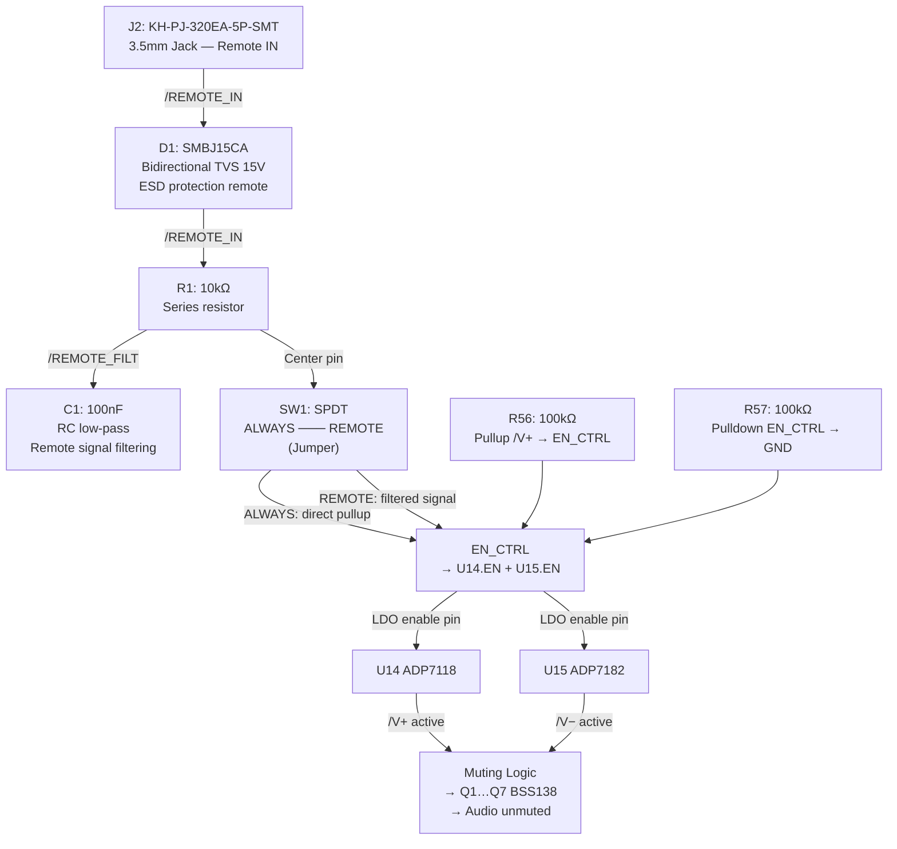

# Muting & Remote Control

[← Back to README](../README.md) | [Power Supply](power-supply.md) | [Gain Configuration](gain-configuration.md)

---

## Remote Control

**Operation:**

- **SW1 = ALWAYS:** EN_CTRL is HIGH (pullup R56 / pulldown R57) → LDOs always active → board always operational
- **SW1 = REMOTE:** EN_CTRL follows the FreeDSP remote signal (J2) via RC filter → board powers on/off with the DSP
- **D1 (SMBJ15CA):** Protects the remote input against overvoltage up to ±15V (bidirectional)

---

## Components — Remote & Muting

| Ref | Value | Function | Net |
|-----|-------|----------|-----|
| J2 | KH-PJ-320EA-5P-SMT | Remote input | PinT=/REMOTE_IN, PinS=GND |
| J15 | KH-PJ-320EA-5P-SMT | Remote passthrough (OUT) | PinT=/REMOTE_IN, PinS=GND |
| D1 | SMBJ15CA | ESD remote 15V bidi | Pin1=/REMOTE_IN, Pin2=GND |
| R1 | 10kΩ | RC series resistor | /REMOTE_IN → /REMOTE_FILT |
| C1 | 100nF C0G | RC low-pass | /REMOTE_FILT → GND |
| SW1 | SW_SPDT | ALWAYS/REMOTE select | COM=/EN_CTRL, A=/REMOTE_FILT, Pin1=/+12V (ALWAYS) |
| R56 | 100kΩ | Pullup EN_CTRL | /V+ → /EN_CTRL |
| R57 | 100kΩ | Pulldown EN_CTRL | /EN_CTRL → GND |
