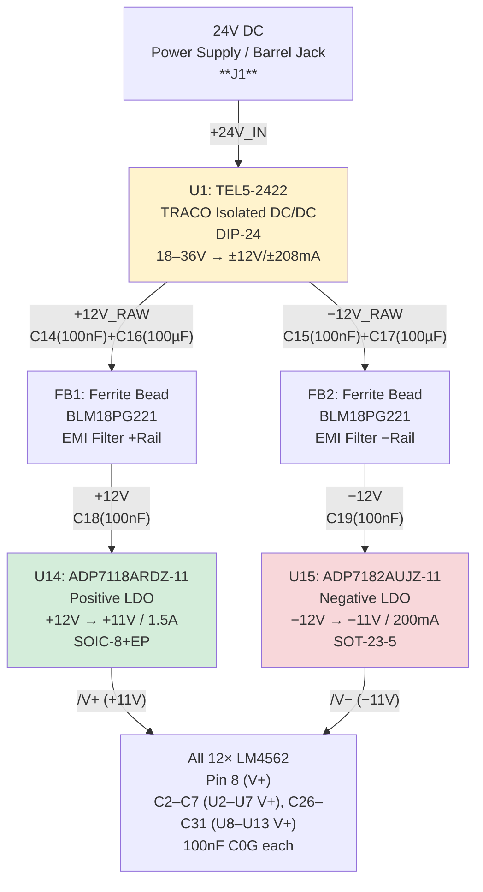

# Power Supply

[← Back to README](../README.md) | [Signal Chain](signal-chain.md) | [Muting & Remote Control](muting-and-remote.md)

---

## Architecture

---

## Components

| Ref | Value | Function | Connection |
|-----|-------|----------|------------|
| J1 | 24V DC Barrel Jack | Power input | Pin1=/+24V_IN, Pin2=GND |
| U1 | TEL5-2422 | Isolated DC/DC, DIP-24 | Pin22/23=/+24V_IN, Pin14=/+12V_RAW, Pin11=/-12V_RAW, Pin2/3/9/16=GND |
| C14 | 100nF C0G | +12V_RAW bypass | /+12V_RAW → GND |
| C15 | 100nF C0G | −12V_RAW bypass | /-12V_RAW → GND |
| C16 | 100µF/25V | +12V_RAW bulk | /+12V_RAW → GND |
| C17 | 100µF/25V | −12V_RAW bulk | /-12V_RAW → GND |
| FB1 | BLM18PG221 | Ferrite +rail | /+12V_RAW → /+12V |
| FB2 | BLM18PG221 | Ferrite −rail | /-12V_RAW → /-12V |
| C18 | 100nF C0G | /+12V bypass (after FB1) | /+12V → GND |
| C19 | 100nF C0G | /-12V bypass | /-12V → GND |
| U14 | ADP7118ARDZ-11 | Positive LDO | Pin7/8=/+12V, Pin1/2/3=/V+, Pin4/9=GND, Pin5=/EN_CTRL, Pin6=/SS_U14 |
| U15 | ADP7182AUJZ-11 | Negative LDO | Pin2=/-12V, Pin5=/V-, Pin1=GND, Pin3=/EN_CTRL, Pin4=/NR_U15 |
| C22 | 100nF C0G | U14 VOUT bypass | /V+ → GND |
| C24 | 10µF X5R | U14 VOUT bulk | /V+ → GND |
| C25 | 10µF X5R | U15 VOUT bulk | /V- → GND |
| C81 | **22nF** C0G | U14 soft-start (SS pin) | /SS_U14 → GND |
| C23 | 100nF C0G | U15 noise reduction (NR pin) | /NR_U15 → GND |
| C20 | 100µF | V+ board bulk | /V+ → GND |
| C21 | 100µF | V− board bulk | /V- → GND |

---

## Op-Amp Decoupling (100nF C0G, 2 per LM4562 = 24 total)

| Refs V+ | Refs V− | IC |
|---------|---------|---|
| C2 | C8 | U2 (CH1 Diff/Gain) |
| C3 | C9 | U3 (CH2 Diff/Gain) |
| C4 | C10 | U4 (CH3 Diff/Gain) |
| C5 | C11 | U5 (CH4 Diff/Gain) |
| C6 | C12 | U6 (CH5 Diff/Gain) |
| C7 | C13 | U7 (CH6 Diff/Gain) |
| C26 | C32 | U8 (CH1 Driver) |
| C27 | C33 | U9 (CH2 Driver) |
| C28 | C34 | U10 (CH3 Driver) |
| C29 | C35 | U11 (CH4 Driver) |
| C30 | C36 | U12 (CH5 Driver) |
| C31 | C37 | U13 (CH6 Driver) |

Additional bulk capacitors for V+ and V− on driver ICs: C74/C75, C76/C77, C78/C79 (10µF X5R each).
