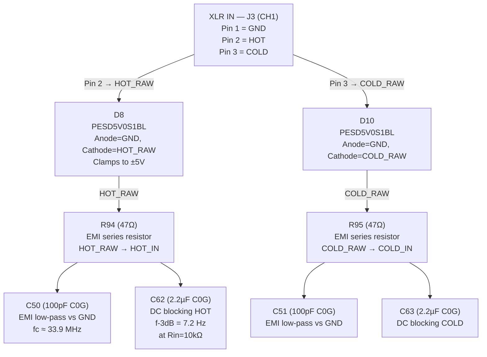
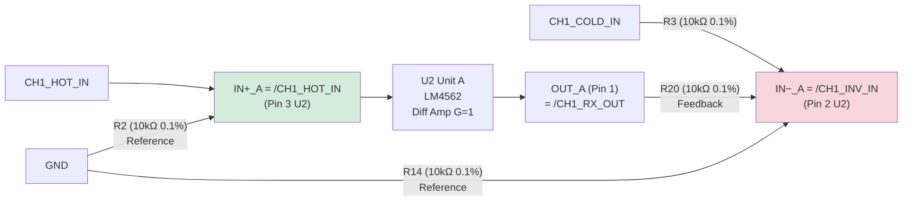
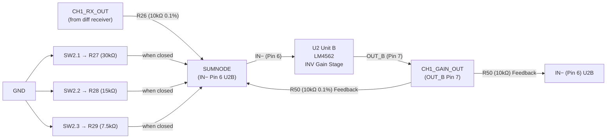
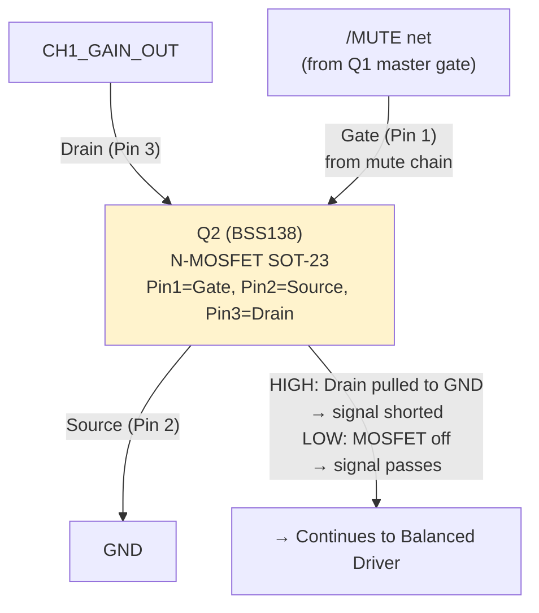
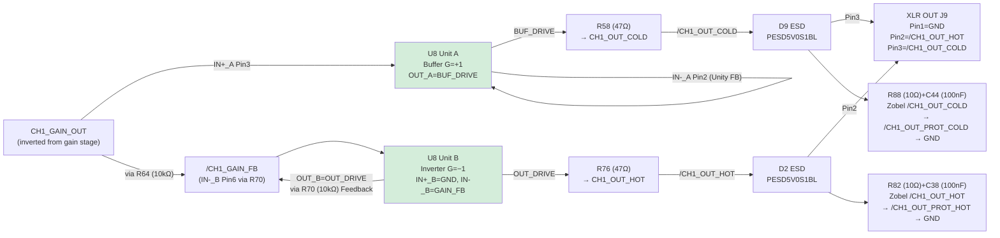
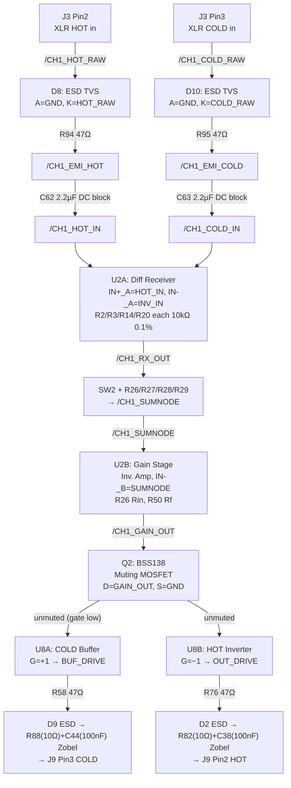

# Signal Chain — Detailed Description

[← Back to README](../README.md) | [Component Reference](component-reference.md) | [Schematic Rebuild Guide](schematic-rebuild-guide.md)

All 6 channels are **identical** in topology. The diagrams below show **CH1** — for CH2–CH6 the same topologies apply with corresponding component numbers (see [channel mapping](schematic-rebuild-guide.md#component-mapping-all-6-channels)).

> **Completeness Note:** All component references, net names, and pin assignments in this document were extracted directly from the verified KiCad netlist (177/177 validations passed) and are sufficient to fully rebuild the schematic without the `.kicad_sch` file.

---

## Overview — Single Channel Stage

---

## Stage 1 — ESD Protection & EMI Filter (Input)

**Components CH1 — ESD & Filter:**

| Ref | Value | Function | Net |
|-----|-------|----------|-----|
| J3 | XLR Female | Input CH1 | Pin1=GND, Pin2=/CH1_HOT_RAW, Pin3=/CH1_COLD_RAW, PinG=GND |
| D8 | PESD5V0S1BL | ESD HOT_RAW | A=GND, K=/CH1_HOT_RAW |
| D10 | PESD5V0S1BL | ESD COLD_RAW | A=GND, K=/CH1_COLD_RAW |
| R94 | 47Ω | EMI filter HOT | /CH1_HOT_RAW → /CH1_EMI_HOT |
| R95 | 47Ω | EMI filter COLD | /CH1_COLD_RAW → /CH1_EMI_COLD |
| C50 | 100pF C0G | HF bypass HOT | /CH1_EMI_HOT → GND |
| C51 | 100pF C0G | HF bypass COLD | /CH1_EMI_COLD → GND |
| C62 | 2.2µF C0G | DC blocking HOT | /CH1_EMI_HOT → /CH1_HOT_IN |
| C63 | 2.2µF C0G | DC blocking COLD | /CH1_EMI_COLD → /CH1_COLD_IN |

---

## Stage 2 — Differential Receiver (LM4562 Unit A)

The differential receiver converts the balanced signal (HOT + COLD) into a single-ended signal and rejects common-mode interference (CMRR ~62 dB).

**Classic differential amplifier formula:**

$$G_{diff} = \frac{R_f}{R_{in}} = \frac{10\,k\Omega}{10\,k\Omega} = 1 \quad (0\,\text{dB})$$

$$CMRR \approx 20 \cdot \log_{10}\!\left(\frac{2 \cdot \frac{\Delta R}{R}}{1}\right)^{-1} \approx 62\,\text{dB}$$
(at 0.1% resistor tolerance)

**Components CH1 — Differential Receiver:**

| Ref | Value | Function | Connection |
|-----|-------|----------|------------|
| U2 (Unit A) | LM4562 | Diff receiver | Pin3=IN+_A, Pin2=IN-_A, Pin1=OUT_A |
| R2 | 10kΩ 0.1% | Rin+ (IN+_A reference) | GND → /CH1_HOT_IN |
| R3 | 10kΩ 0.1% | Rg (COLD input) | /CH1_COLD_IN → /CH1_INV_IN |
| R14 | 10kΩ 0.1% | Rref- (IN-_A reference) | GND → /CH1_INV_IN |
| R20 | 10kΩ 0.1% | Rf (feedback) | /CH1_RX_OUT → /CH1_INV_IN |

---

## Stage 3 — Gain Stage (LM4562 Unit B)

The second op-amp unit (Unit B of the same LM4562) amplifies the signal in inverting configuration. The three DIP switch resistors are connected **in parallel** with the input resistor R, thereby lowering the effective Rin → higher gain.

**Components CH1 — Gain Stage:**

| Ref | Value | Function | Connection |
|-----|-------|----------|------------|
| U2 (Unit B) | LM4562 | Gain amplifier (inv.) | Pin6=IN-_B=/CH1_SUMNODE, Pin5=IN+_B=GND, Pin7=OUT_B |
| R26 | 10kΩ 0.1% | Rin (input) | /CH1_RX_OUT → /CH1_SUMNODE |
| R50 | 10kΩ 0.1% | Rf (feedback) | /CH1_GAIN_OUT → /CH1_SUMNODE |
| R27 | 30kΩ | DIP SW2 Pos1 | /CH1_SW_OUT_1 → /CH1_SUMNODE (parallel to Rin when SW closed) |
| R28 | 15kΩ | DIP SW2 Pos2 | /CH1_SW_OUT_2 → /CH1_SUMNODE |
| R29 | 7.5kΩ | DIP SW2 Pos3 | /CH1_SW_OUT_3 → /CH1_SUMNODE |
| SW2 | SW_DIP_x03 | Gain select CH1 | Pos1→/CH1_SW_OUT_1, Pos2→/CH1_SW_OUT_2, Pos3→/CH1_SW_OUT_3 (other side = /CH1_RX_OUT) |

---

## Stage 4 — Muting (BSS138 MOSFET)

During power-up, the LDOs are activated only after an RC delay. While the supply stabilizes, Q2–Q7 block the signal path and prevent power-on pop/click noise.

> **Muting Logic (Power-On Sequence):**
>
> 1. LDOs activate → /V+ rises
> 2. R107 (100kΩ, /V+ → /MUTE) immediately pulls /MUTE HIGH
> 3. Q2–Q7 (Gate = HIGH via R108–R113) conduct → all GAIN_OUT nets shorted to GND → **audio muted**
> 4. Simultaneously, R106 (10kΩ) + C80 (10µF) charge Q1's gate: τ = R106 × C80 = 100 ms
> 5. After ~100 ms: Q1 gate > V_th → Q1 conducts → /MUTE pulled to GND
> 6. Q2–Q7 gates = GND → turn off → **audio unmuted**
>
> Result: 100 ms after LDO activation, muting is released. Prevents power-on pops.

**Components — Muting (all channels):**

| Ref | Value | Function | Connection |
|-----|-------|----------|------------|
| R106 | 10kΩ | Q1 gate charge R | /V+ → Net-(Q1-G) |
| C80 | 10µF | RC timing Q1 | Net-(Q1-G) → GND (τ = 100 ms) |
| Q1 | BSS138 | Master mute MOSFET | G=Net-(Q1-G), S=GND, D=/MUTE |
| R107 | 100kΩ | /MUTE pullup | /V+ → /MUTE |
| R108 | 10kΩ | Gate R Q2 | /MUTE → Net-(Q2-G) |
| R109 | 10kΩ | Gate R Q3 | /MUTE → Net-(Q3-G) |
| R110 | 10kΩ | Gate R Q4 | /MUTE → Net-(Q4-G) |
| R111 | 10kΩ | Gate R Q5 | /MUTE → Net-(Q5-G) |
| R112 | 10kΩ | Gate R Q6 | /MUTE → Net-(Q6-G) |
| R113 | 10kΩ | Gate R Q7 | /MUTE → Net-(Q7-G) |
| Q2 | BSS138 | Mute CH1 | G=Net-(Q2-G), S=GND, D=/CH1_GAIN_OUT |
| Q3 | BSS138 | Mute CH2 | G=Net-(Q3-G), S=GND, D=/CH2_GAIN_OUT |
| Q4 | BSS138 | Mute CH3 | G=Net-(Q4-G), S=GND, D=/CH3_GAIN_OUT |
| Q5 | BSS138 | Mute CH4 | G=Net-(Q5-G), S=GND, D=/CH4_GAIN_OUT |
| Q6 | BSS138 | Mute CH5 | G=Net-(Q6-G), S=GND, D=/CH5_GAIN_OUT |
| Q7 | BSS138 | Mute CH6 | G=Net-(Q7-G), S=GND, D=/CH6_GAIN_OUT |

---

## Stage 5 — Balanced Driver (LM4562, 2nd IC)

A separate LM4562 generates a balanced output signal from the single-ended gain signal.

- **Unit A** buffers the (already inverted) gain signal → feeds XLR Pin 3 (COLD = inverted)
- **Unit B** inverts once more → feeds XLR Pin 2 (HOT = double inversion = correct polarity)

The gain stage (U2B) is inverting, so GAIN_OUT is already phase-flipped. The driver restores the correct polarity at both XLR pins.

**Components CH1 — Balanced Driver & Output:**

| Ref | Value | Function | Connection |
|-----|-------|----------|------------|
| U8 (Unit A) | LM4562 | COLD buffer (G=+1) | IN+_A(Pin3)=/CH1_GAIN_OUT, IN-_A(Pin2)=OUT_A(Unity FB), OUT_A(Pin1)=/CH1_BUF_DRIVE |
| U8 (Unit B) | LM4562 | HOT inverter (G=−1) | IN+_B(Pin5)=GND, IN-_B(Pin6)=/CH1_GAIN_FB, OUT_B(Pin7)=/CH1_OUT_DRIVE |
| R64 | 10kΩ | Inverter Rin | /CH1_GAIN_OUT → /CH1_GAIN_FB |
| R70 | 10kΩ | Inverter Rf | /CH1_OUT_DRIVE → /CH1_GAIN_FB |
| R58 | 47Ω | Series R COLD | /CH1_BUF_DRIVE → /CH1_OUT_COLD |
| R76 | 47Ω | Series R HOT | /CH1_OUT_DRIVE → /CH1_OUT_HOT |
| D9 | PESD5V0S1BL | ESD OUT_COLD | A=GND, K=/CH1_OUT_COLD |
| D2 | PESD5V0S1BL | ESD OUT_HOT | A=GND, K=/CH1_OUT_HOT |
| R88 | 10Ω | Zobel R COLD | /CH1_OUT_COLD → /CH1_OUT_PROT_COLD |
| C44 | 100nF C0G | Zobel C COLD | /CH1_OUT_PROT_COLD → GND |
| R82 | 10Ω | Zobel R HOT | /CH1_OUT_HOT → /CH1_OUT_PROT_HOT |
| C38 | 100nF C0G | Zobel C HOT | /CH1_OUT_PROT_HOT → GND |
| J9 | XLR Male | Output CH1 | Pin1=GND, Pin2=/CH1_OUT_HOT, Pin3=/CH1_OUT_COLD |

---

## Complete Signal Chain CH1 (all net names)

